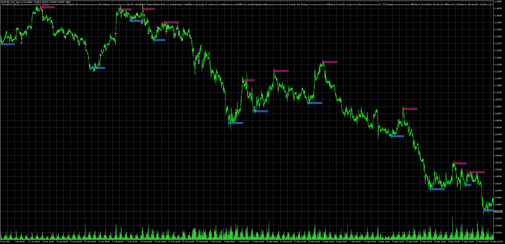

# ChaosArrZZ_EA

> Source: https://fxcodebase.com/code/viewtopic.php?f=38&t=72975  
> Forum: 38 · Topic 72975 · 10 post(s)

---

## ChaosArrZZ_EA

**Apprentice** · Tue Nov 29, 2022 7:53 am

Based on the request.
[https://fxcodebase.com/code/viewtopic.php?f=27&p=148450](https://fxcodebase.com/code/viewtopic.php?f=27&p=148450)

 [#Chaos ArrZZx2.mq5](files/148465/Chaos%20ArrZZx2.mq5)

 [ChaosArrZZ_EA.mq5](files/148465/ChaosArrZZ_EA.mq5)

---

## Re: ChaosArrZZ_EA

**rose123** · Tue Nov 29, 2022 11:44 pm

Hi apprentice,

Can you create this indicator for trading station

---

## Re: ChaosArrZZ_EA

**Apprentice** · Thu Dec 01, 2022 6:08 am

We have added your request to the development list.
Development reference 787.

---

## Re: ChaosArrZZ_EA

**wems007** · Fri Dec 02, 2022 7:37 am

Hi Apprentice,

 Please small adjustments. The entries are far from where I would like the trades to be opened ,Trades should be opened at the close of the candle where arrow 1st appears .See Attached Picture.
Or add an input option where we can choose either to use the arrows or the current signal mode to enter positions.

---

## Re: ChaosArrZZ_EA

**wems007** · Sat Dec 03, 2022 6:14 am

Hi,

Please can you change and use the arrow signals for entering the trades

---

## Re: ChaosArrZZ_EA

**Apprentice** · Mon Dec 05, 2022 6:05 am

We have added your request to the development list.
Development reference 798.

---

## Re: ChaosArrZZ_EA

**wems007** · Fri Dec 09, 2022 3:43 am

Hello Apprentice,

 Please any update about modifying the EA to use arrows for buy and sell.

Thanks

---

## Re: ChaosArrZZ_EA

**wems007** · Fri Dec 16, 2022 10:27 pm

Hi

Please any update ?

---

## Re: ChaosArrZZ_EA

**rose123** · Mon Mar 27, 2023 4:27 am

> **rose123 wrote:**
> Hi apprentice,
>
> Can you create this indicator for trading station

hi apprendice,

this is to remind my request posted 6 months back

thank u.

---

## Re: ChaosArrZZ_EA

**Apprentice** · Mon Jan 20, 2025 10:57 am

The indicator algorithm draws arrows in the past. It never draws an arrow at the current bar. There is nothing we can do with that,
