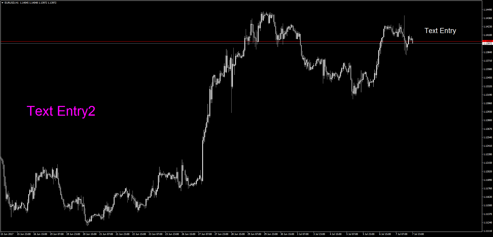

# Chart Notes

> Source: https://fxcodebase.com/code/viewtopic.php?f=38&t=64909  
> Forum: 38 · Topic 64909 · 1 post(s)

---

## Chart Notes

**Apprentice** · Sat Jul 08, 2017 5:57 am

TS2 version [viewtopic.php?f=17&t=63167](https://fxcodebase.com/code/viewtopic.php?f=17&t=63167)

Description:

The notes can be entered into a text box and set in a user specified position on the chart. Once this is done the note stays in the same place on the chart irrespective of the time frame. Multiple instances of the indicator can be put into the chart for having several notes. Customizable colors, font size, font family.

 [ChartNotes.mq4](files/113452/ChartNotes.mq4)
