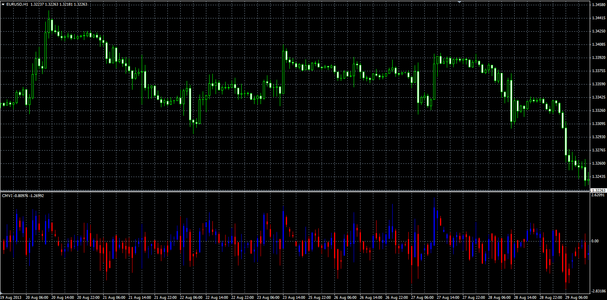

# Chartmill Value Indicator

> Source: https://fxcodebase.com/code/viewtopic.php?f=38&t=59352  
> Forum: 38 · Topic 59352 · 1 post(s)

---

## Chartmill Value Indicator

**Alexander.Gettinger** · Thu Aug 29, 2013 11:07 am

Original LUA indicator: [http://fxcodebase.com/code/viewtopic.php?f=17&t=51747](https://fxcodebase.com/code/viewtopic.php?f=17&t=51747).

Formulas:
C[i] = (Close[i]-MA)/ATR,
H[i] = (High[i]-MA)/ATR,
L[i] = (Low[i]-MA)/ATR,
O[i] = (Open[i]-MA)/ATR, where
MA = Moving average(Median Price, Length, Method),
ATR = Average True Range(Length).

 

Download:

 [CMVI.mq4](files/89016/CMVI.mq4)
