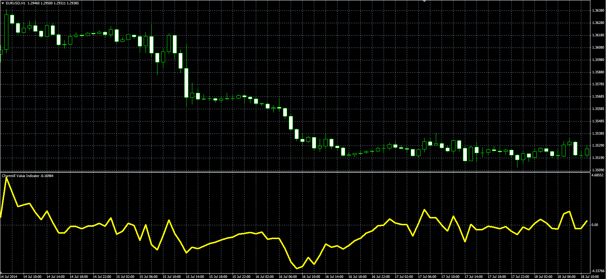

# Chartmill Value Indicator

> Source: https://fxcodebase.com/code/viewtopic.php?f=38&t=61172  
> Forum: 38 · Topic 61172 · 4 post(s)

---

## Chartmill Value Indicator

**Alexander.Gettinger** · Thu Sep 18, 2014 9:34 am

Original LUA indicator: [viewtopic.php?f=17&t=32171](https://fxcodebase.com/code/viewtopic.php?f=17&t=32171).

Formula:
CVI = (Close-VC)/ATR, where
VC = MA(Price) with [Length] number of periods and [Method] type,
ATR - Average True Range with [Length] number of periods.

 

Download:

 [CVI.mq4](files/95985/CVI.mq4)

---

## Re: Chartmill Value Indicator

**PURABI** · Sun Aug 30, 2020 11:51 am

PLEASE add multitimeframe and multi symbol options

---

## Re: Chartmill Value Indicator

**Apprentice** · Mon Aug 31, 2020 8:08 am

Your request is added to the development list.
Development reference 1946.

---

## Re: Chartmill Value Indicator

**Apprentice** · Thu Sep 03, 2020 2:52 am

[CVI_Multi.mq4](files/137275/CVI_Multi.mq4)

Try this version.
