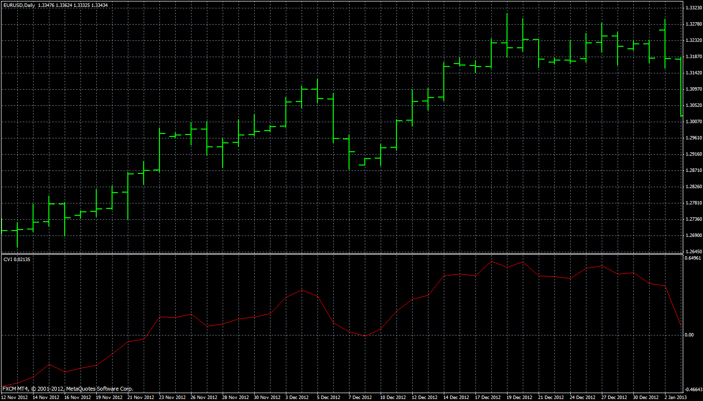

# Chartmill Value Indicator

> Source: https://fxcodebase.com/code/viewtopic.php?f=38&t=33984  
> Forum: 38 · Topic 33984 · 1 post(s)

---

## Chartmill Value Indicator

**Apprentice** · Sun Mar 31, 2013 6:13 am

The Chartmill Value Indicator as described in January 2013 issue of Technical Analysis of Stocks and Commodities. The CVI represents a standardized deviation from a moving average.
Chartmill Value Indicator
Value Consensus
(VC) = MA of Median Price
Chartmill Value Indicator
CVI = (Close – VC) / ATR
Modified Chartmill Value Indicator
(MCVI) = (CClose – VC) / (ATR * (Period ^ 0.5))

 [CVI.mq4](files/57724/CVI.mq4)
