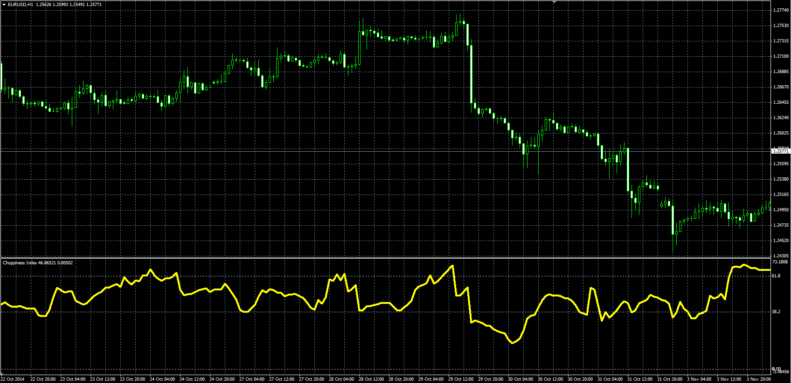
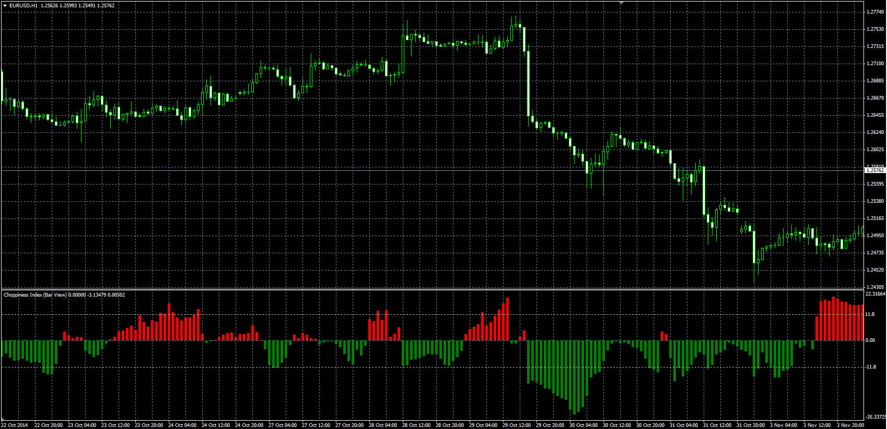

# Choppiness Index

> Source: https://fxcodebase.com/code/viewtopic.php?f=38&t=61500  
> Forum: 38 · Topic 61500 · 1 post(s)

---

## Choppiness Index

**Alexander.Gettinger** · Thu Nov 20, 2014 5:48 pm

Original LUA oscillator: [viewtopic.php?f=17&t=7115](https://fxcodebase.com/code/viewtopic.php?f=17&t=7115).

> mjdesmond3001 wrote:
> 100 * LOG10( SUM(ATR(1), x) / ( MaxHi(x) - MinLo(x) ) ) / LOG10(x)
> where x = Choppiness Period
> LOG10(x) is base-10 LOG of x
> ATR(1) is the True Range (Period of 1)
> SUM(ATR(1), x) is the Sum of the True Range over past x bars
> MaxHi(x) is the highest high over past x bars
>
> The Choppiness Index is designed to measure the market's trendiness (values below 38.20) versus the market's choppiness (values above 61.80). When the indicator is reading values near 100, the market is considered to be in choppy consolidation. The lower the value of the Choppiness Index, the more the market is trending. The period supplied by the user dictates how many bars are used to compute the index.

 

Download:

 [chop_idx.mq4](files/97237/chop_idx.mq4)

 

Download:

 [chop_idx1.mq4](files/97237/chop_idx1.mq4)
