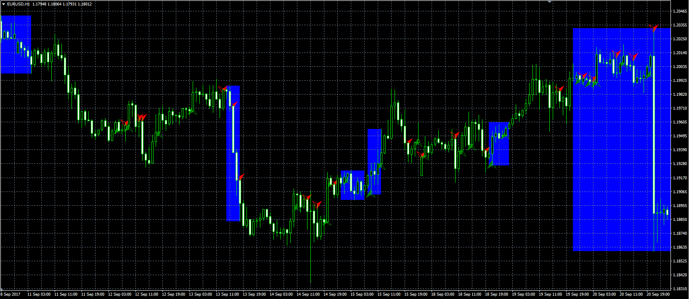

# Choppy market ADX Indicator

> Source: https://fxcodebase.com/code/viewtopic.php?f=38&t=65132  
> Forum: 38 · Topic 65132 · 4 post(s)

---

## Choppy market ADX Indicator

**Alexander.Gettinger** · Fri Sep 29, 2017 11:18 am

Original LUA indicator: [viewtopic.php?f=17&t=64999](https://fxcodebase.com/code/viewtopic.php?f=17&t=64999).

 

Download:

 [Choppy_Market_ADX_Indicator.mq4](files/115164/Choppy_Market_ADX_Indicator.mq4)

Smoothed_ADX.mq4 (necessary for this indicator) is available here: [viewtopic.php?f=38&t=65130](https://fxcodebase.com/code/viewtopic.php?f=38&t=65130)

---

## Re: Choppy market ADX Indicator

**nookie** · Fri Feb 02, 2018 3:02 pm

Is it possible this indicator to be based on the "Wilders DMI request" ?

[viewtopic.php?f=27&t=63034](https://fxcodebase.com/code/viewtopic.php?f=27&t=63034)

---

## Re: Choppy market ADX Indicator

**Apprentice** · Mon Feb 05, 2018 5:04 pm

Your request is added to the development list under Id Number 4036

---

## Re: Choppy market ADX Indicator

**Apprentice** · Fri Feb 09, 2018 7:05 am

[Choppy_Market_ADX_Indicator.nookie.mq4](files/117671/Choppy_Market_ADX_Indicator.nookie.mq4)

Wilders DMI version
Wilders DMI is available here.
[viewtopic.php?f=38&t=65625&hilit=Wilders+dmi](https://fxcodebase.com/code/viewtopic.php?f=38&t=65625&hilit=Wilders+dmi)
