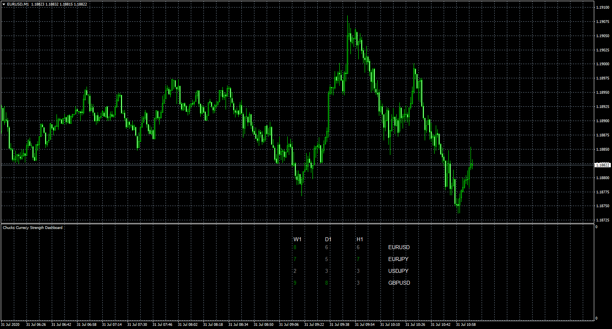

# Chucks Currecy Strength Dashboard

> Source: https://fxcodebase.com/code/viewtopic.php?f=38&t=70248  
> Forum: 38 · Topic 70248 · 5 post(s)

---

## Chucks Currecy Strength Dashboard

**Apprentice** · Fri Jul 31, 2020 4:58 am

Based on request.
[viewtopic.php?f=27&t=70179](https://fxcodebase.com/code/viewtopic.php?f=27&t=70179)

 [Chucks Currecy Strength Dashboard.mq4](files/136469/Chucks%20Currecy%20Strength%20Dashboard.mq4)

---

## Re: Chucks Currecy Strength Dashboard

**Chucks** · Mon Aug 03, 2020 5:06 pm

I appreciate your gesture. Thanks/.

---

## Re: Chucks Currecy Strength Dashboard

**Chucks** · Mon Aug 03, 2020 5:46 pm

Please can you make the dashboard to be on the indicator_chart_window.

---

## Re: Chucks Currecy Strength Dashboard

**Apprentice** · Tue Aug 04, 2020 4:38 am

Your request is added to the development list.
Development reference 1825.

---

## Re: Chucks Currecy Strength Dashboard

**Apprentice** · Tue Aug 04, 2020 4:59 am

[Indicator_chart_window Currecy Strength Dashboard.mq4](files/136572/Indicator_chart_window%20Currecy%20Strength%20Dashboard.mq4)

Try this version.
