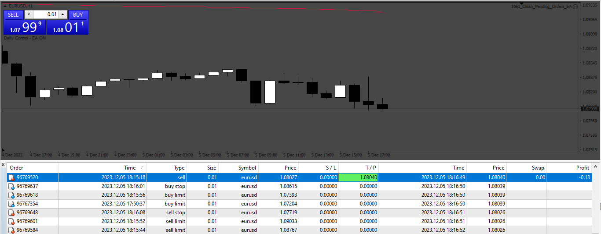

# Clean_Pending_Orders_EA

> Source: https://fxcodebase.com/code/viewtopic.php?f=38&t=74431  
> Forum: 38 · Topic 74431 · 2 post(s)

---

## Clean_Pending_Orders_EA

**Apprentice** · Sun Dec 10, 2023 3:54 am

Based on the request.
[https://fxcodebase.com/code/viewtopic.php?f=17&t=74408](https://fxcodebase.com/code/viewtopic.php?f=17&t=74408)

 [Clean_Pending_Orders_EA.mq4](files/153628/Clean_Pending_Orders_EA.mq4)

---

## Re: Clean_Pending_Orders_EA

**xmohammad** · Sun Dec 10, 2023 8:17 am

> **Apprentice wrote:**
>
>
> 1061.png
>
>
> Based on the request.
> [https://fxcodebase.com/code/viewtopic.php?f=17&t=74408](https://fxcodebase.com/code/viewtopic.php?f=17&t=74408)
>
>
> Clean_Pending_Orders_EA.mq4

Misdesign does not remove the burnt position
So that you understand what I mean
Leave only one pending and specify its tp
When the price hits the TP without opening the position, the position is burned and the game is over
