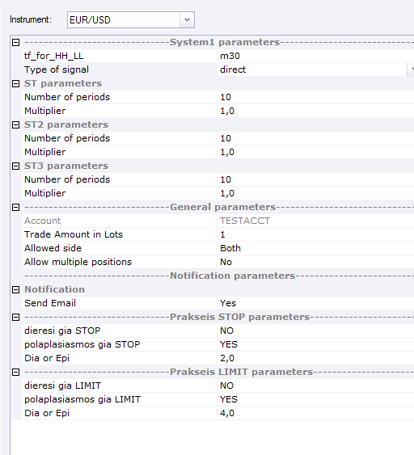
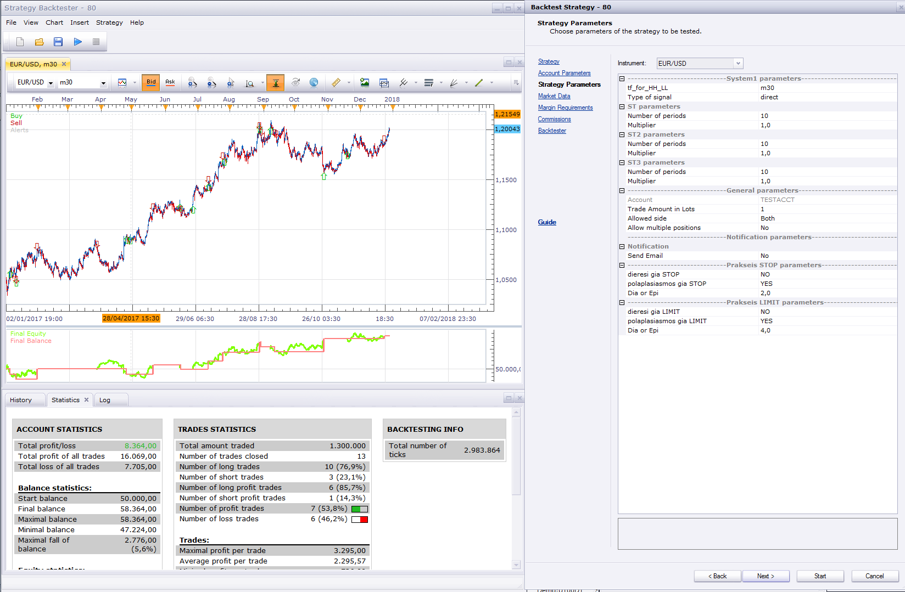
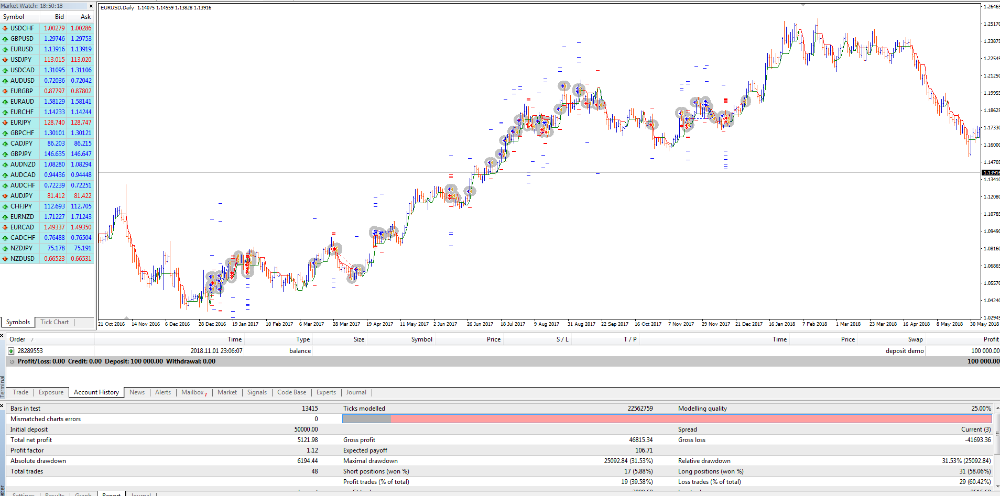

# close_all_at_total_equity

> Source: https://fxcodebase.com/code/viewtopic.php?f=38&t=66881  
> Forum: 38 · Topic 66881 · 9 post(s)

---

## close_all_at_total_equity

**Apprentice** · Thu Nov 01, 2018 4:20 pm

Based on request.
[viewtopic.php?f=27&t=66868](https://fxcodebase.com/code/viewtopic.php?f=27&t=66868)

 [close_all_at_total_equity.mq4](files/121905/close_all_at_total_equity.mq4)

An EA which looks for the profit/loss accumulated by the running orders.
after reaching the desired value (profit/loss), all the running orders should be closed.

 [close all positions at profit target.mq4](files/121905/close%20all%20positions%20at%20profit%20target.mq4)

---

## 80

**Apprentice** · Thu Nov 01, 2018 4:21 pm

Based on request.
[viewtopic.php?f=27&t=66868](https://fxcodebase.com/code/viewtopic.php?f=27&t=66868)

 [80.mq4](files/121906/80.mq4)

---

## Re: 80

**conjure** · Fri Nov 02, 2018 7:23 am

> **Apprentice wrote:**
> Based on request.
> [viewtopic.php?f=27&t=66868](https://fxcodebase.com/code/viewtopic.php?f=27&t=66868)
>
>
> The attachment **80.mq4** is no longer available

Hi Apprentice.
I downloaded and back tested the EA on MT4
and does not give me the same results as the LUA on TS2

Can you try to backtest it, with these settings i upload for 2017 , on both platforms
to see what is wrong?

 

---

## Re: close_all_at_total_equity

**Apprentice** · Fri Nov 02, 2018 12:32 pm

Can you provide more info, post chart examples?
Are we talk about different signal times or different profit levels.

---

## Re: close_all_at_total_equity

**conjure** · Fri Nov 02, 2018 12:51 pm

This is the Lua backtest where it trades 13 times

 

and this is the MT4 results where i have 48 trades

 

---

## Re: close_all_at_total_equity

**Apprentice** · Fri Nov 02, 2018 4:24 pm

All simulation are just that, simulation.
Different trading stations use different algorithms with different degrees of accuracy.
As such, the results are not comparable.

You will get more comparable results if you run them on the demo.

---

## Re: close_all_at_total_equity

**conjure** · Fri Nov 02, 2018 6:00 pm

Is it possible to add a parameter to not allow multiple positions?
I think that is the problem

---

## Re: close_all_at_total_equity

**Apprentice** · Sat Nov 03, 2018 4:55 am

Your request is added to the development list under Id Number 4296

---

## Re: close_all_at_total_equity

**Apprentice** · Mon Nov 05, 2018 5:47 am

Try it now.
