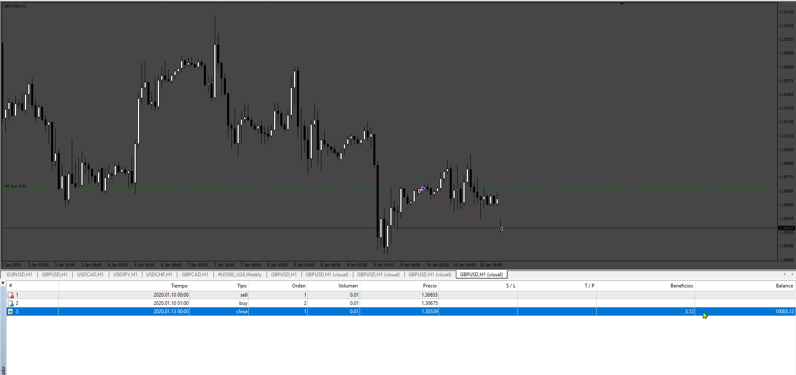

# Close_Order_Coef

> Source: https://fxcodebase.com/code/viewtopic.php?f=38&t=75202  
> Forum: 38 · Topic 75202 · 4 post(s)

---

## Close_Order_Coef

**Apprentice** · Tue Sep 10, 2024 12:15 pm

Based on the request.
[https://fxcodebase.com/code/viewtopic.p ... 37#p156537](https://fxcodebase.com/code/viewtopic.php?f=27&t=75166&p=156537#p156537)

 [Close_Order_Coef.mq4](files/156654/Close_Order_Coef.mq4)

---

## Re: Close_Order_Coef

**Viss26** · Tue Dec 03, 2024 10:31 pm

> **Apprentice wrote:**
>
>
> 688.png
>
>
> Based on the request.
> [https://fxcodebase.com/code/viewtopic.p ... 37#p156537](https://fxcodebase.com/code/viewtopic.php?f=27&t=75166&p=156537#p156537)
>
>
> Close_Order_Coef.mq4

Здравствуйте! Можно добавить еще одну переменную и вставить индикатор боллинджера? Переменная допустим 2 и для ордеров бай, если цена находится выше верхней боллинджера, то коэффициент делим на 2, для ордеров селл - если под нижней боллинджера уменьшаем вдвое коэффициент. И добавить выбор ТФ на котором будет стоять боллинджер.

Hello! Is it possible to add another variable and insert the Bollinger indicator? Let's say the variable is 2 and for buy orders, if the price is above the upper Bollinger, then we divide the coefficient by 2, for sell orders - if below the lower Bollinger, we halve the coefficient. And add the choice of TF on which the Bollinger will be.

---

## Re: Close_Order_Coef

**Apprentice** · Thu Dec 05, 2024 1:23 pm

We have added your request to the development list.
Development reference 888

---

## Re: Close_Order_Coef

**Apprentice** · Mon Dec 30, 2024 7:17 pm

[Close_Order_Coef_v2.mq4](files/157635/Close_Order_Coef_v2.mq4)

Try this version.
