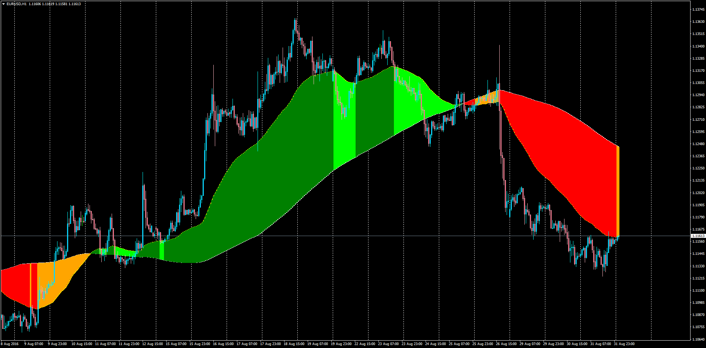

# CLOUD

> Source: https://fxcodebase.com/code/viewtopic.php?f=38&t=63831  
> Forum: 38 · Topic 63831 · 5 post(s)

---

## CLOUD

**Apprentice** · Thu Sep 01, 2016 2:11 pm

LUA Original: [viewtopic.php?f=17&t=1589&hilit=cloud](https://fxcodebase.com/code/viewtopic.php?f=17&t=1589&hilit=cloud)

The relationship between the moving average determines the color of the clouds.
We distinguish 4 cases.
Short & Long Growing
Growing Short & Long Falling
Falling Short & Long Growing
Short & Long Falling

Alert Description: When Cloud changes from Up mode to Down mode and vice-versa.

 [CLOUD.mq4](files/107918/CLOUD.mq4)

 [CLOUD.mq5](files/107918/CLOUD.mq5)

---

## Re: CLOUD

**Apprentice** · Sat Feb 11, 2017 3:59 am

Indicator was revised and updated.

---

## Re: CLOUD

**Gilles** · Fri Jun 19, 2020 4:48 am

Hi, Apprentice !

Please a MT5 version, thank you very much !
See you soon :) !

---

## Re: CLOUD

**Apprentice** · Sun Jun 21, 2020 4:11 am

Your request is added to the development list.
Development reference 1527.

---

## Re: CLOUD

**Apprentice** · Thu Jun 25, 2020 7:18 am

CLOUD.mq5 added.
