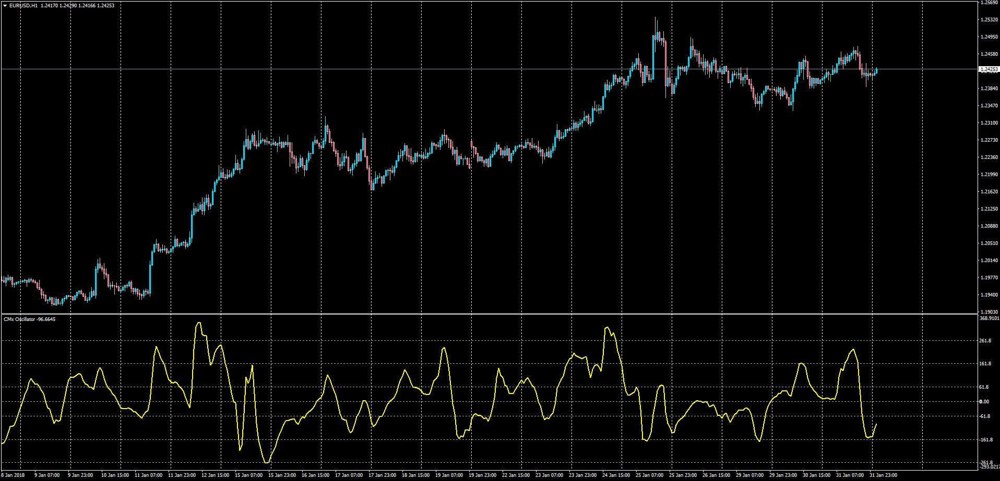

# CMx Oscillator

> Source: https://fxcodebase.com/code/viewtopic.php?f=38&t=65687  
> Forum: 38 · Topic 65687 · 1 post(s)

---

## CMx Oscillator

**Apprentice** · Thu Feb 01, 2018 6:57 pm

LUA Original: [viewtopic.php?f=17&t=59971](https://fxcodebase.com/code/viewtopic.php?f=17&t=59971)

Description:

MT4 version of the LUA Original indicator, which is compilation of Moving Average, CCI, ADX и Fibonacci levels.

Formulas:

CMx[i] = CCI[i]*ADX[i]/(L*K), where
ADX[i] - Average Directional Movement Index with Period as Length,
CCI[i] = (Diff[i]-mean)/(meandev*0.015),
mean, meandev - mean and mean deviation of Diff at range from (i-K_Period+1) to i,
Diff[i] = EMA[i]-EMA_K[i],
EMA - exponential moving average with Period as Length,
EMA_K - exponential moving average with K_Period as Length,
K_Period = Period*K.

 [CMx_Oscillator.mq4](files/117402/CMx_Oscillator.mq4)
