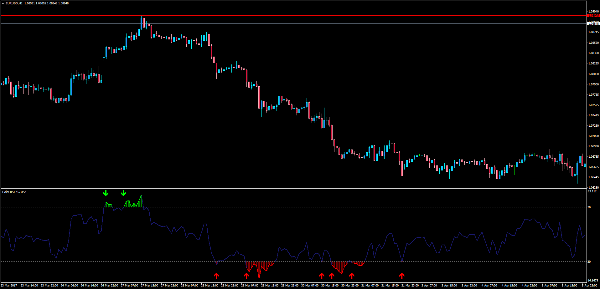
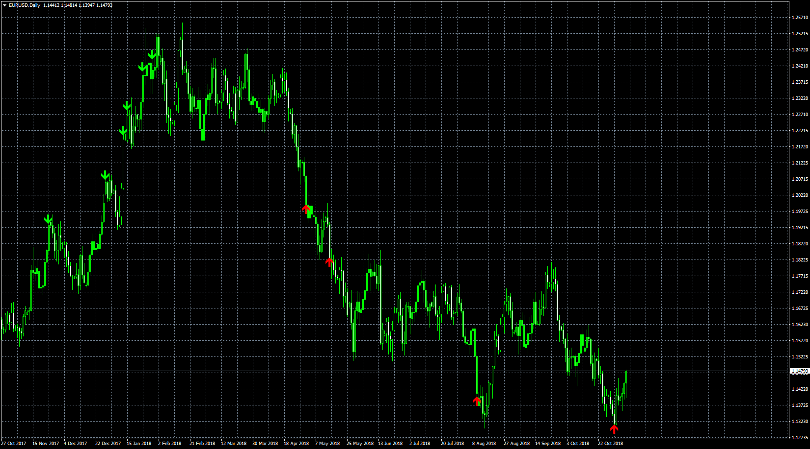

# Color RSI

> Source: https://fxcodebase.com/code/viewtopic.php?f=38&t=64634  
> Forum: 38 · Topic 64634 · 2 post(s)

---

## Color RSI

**Apprentice** · Mon May 01, 2017 3:41 am

LUA Original: [viewtopic.php?f=17&t=21622](https://fxcodebase.com/code/viewtopic.php?f=17&t=21622)

Description:

MT4 version of the LUA Original "Color RSI". The indicator highlights of RSI corresponding the conditions: RSI>OverBought or RSI<OverSold. The arrows show the first entry in the zones.

 [Color_RSI.mq4](files/112228/Color_RSI.mq4)

MTF version.
[https://fxcodebase.com/code/viewtopic.php?f=38&t=73617](https://fxcodebase.com/code/viewtopic.php?f=38&t=73617)

---

## Color_RSI_arrows

**Apprentice** · Wed Nov 07, 2018 6:12 am

 [Color_RSI_arrows.mq4](files/121990/Color_RSI_arrows.mq4)
