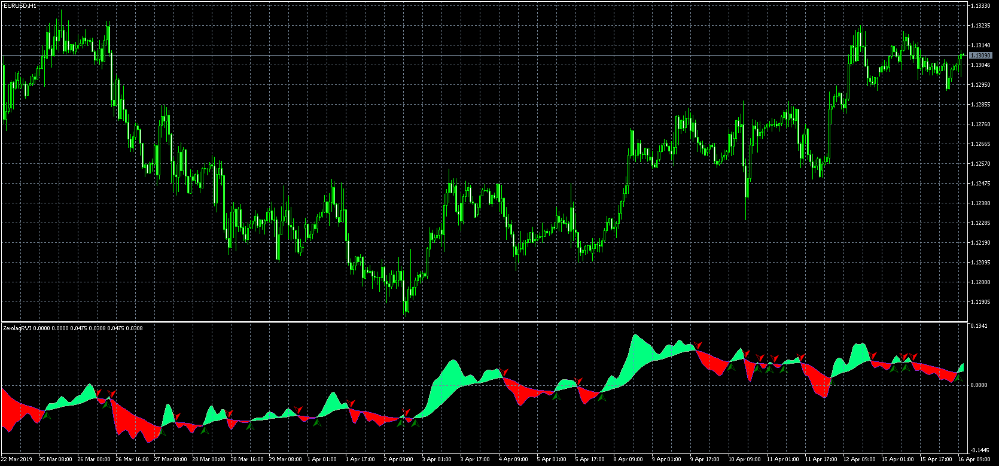

# Color Zero-Lag RVI

> Source: https://fxcodebase.com/code/viewtopic.php?f=38&t=68345  
> Forum: 38 · Topic 68345 · 6 post(s)

---

## Color Zero-Lag RVI

**Apprentice** · Tue Apr 16, 2019 4:56 am

 [colorzerolagrvi.mq5](files/125779/colorzerolagrvi.mq5)

MT4/MQ4 version.
[viewtopic.php?f=38&t=69007](https://fxcodebase.com/code/viewtopic.php?f=38&t=69007)

---

## Re: Color Zero-Lag RVI

**nelsen** · Wed Oct 09, 2019 6:46 pm

> **Apprentice wrote:**
>
>
> eurusd-h1-metaquotes-software-corp-3.png
>
>
>
>
> colorzerolagrvi.mq5

Hello, Apprentice
here,
this indicator is really interesting, is it possible to create it for mt4

---

## Re: Color Zero-Lag RVI

**Apprentice** · Thu Oct 10, 2019 12:29 pm

Your request is added to the development list.
Development reference 173.

---

## Re: Color Zero-Lag RVI

**nelsen** · Thu Oct 10, 2019 2:40 pm

> **Apprentice wrote:**
> Your request is added to the development list.
> Development reference 173.

Thanks Apprentice

---

## Re: Color Zero-Lag RVI

**Apprentice** · Fri Oct 11, 2019 10:31 am

MT4/MQ4 version.
[viewtopic.php?f=38&t=69007](https://fxcodebase.com/code/viewtopic.php?f=38&t=69007)

---

## Re: Color Zero-Lag RVI

**nelsen** · Sun Oct 13, 2019 2:41 am

> **Apprentice wrote:**
> MT4/MQ4 version.
> [viewtopic.php?f=38&t=69007](https://fxcodebase.com/code/viewtopic.php?f=38&t=69007)

Thank you for your work. the quality is better on mt5 but it's good.
