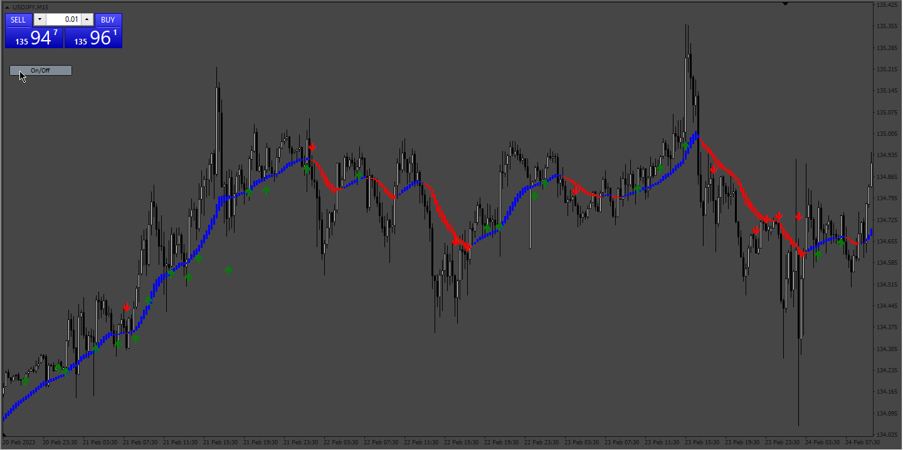
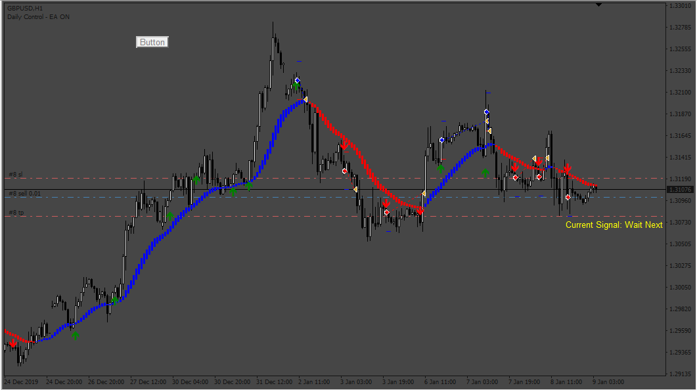
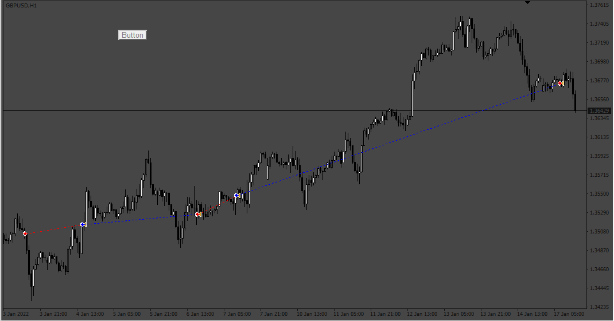
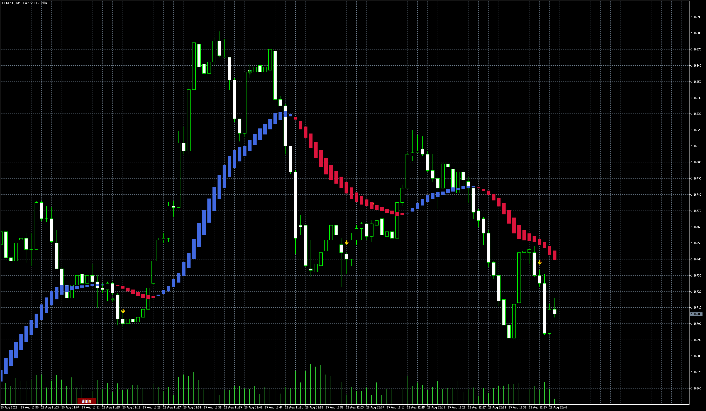

# Combine_two_indicators_into_one_WithButton

> Source: https://fxcodebase.com/code/viewtopic.php?f=38&t=73457  
> Forum: 38 · Topic 73457 · 13 post(s)

---

## Combine_two_indicators_into_one_WithButton

**Apprentice** · Sun Mar 05, 2023 6:31 pm

Based on the request.
[https://fxcodebase.com/code/viewtopic.php?f=27&p=149765](https://fxcodebase.com/code/viewtopic.php?f=27&p=149765)

 [Combine_two_indicators_into_one_WithButton.mq4](files/149879/Combine_two_indicators_into_one_WithButton.mq4)

---

## Re: Combine_two_indicators_into_one_WithButton

**rohitypatil096** · Wed Mar 08, 2023 5:10 am

hi sir

can u provide EA for this indicator

---

## Re: Combine_two_indicators_into_one_WithButton

**rohitypatil096** · Wed Mar 08, 2023 5:13 am

HI SIR

CAN U PROVIDE EA FOR THIS INDICATOR.

CONDITION IS BUY AND SELL ON ARROW.

---

## Re: Combine_two_indicators_into_one_WithButton

**Apprentice** · Sat Mar 11, 2023 4:23 am

We have added your request to the development list.
Development reference 233.

---

## Re: Combine_two_indicators_into_one_WithButton

**rohitypatil096** · Tue Mar 14, 2023 5:05 am

> **Apprentice wrote:**
> We have added your request to the development list.
> Development reference 233.

HI SIR

ANY UPDATE ON THIS

---

## Re: Combine_two_indicators_into_one_WithButton

**Apprentice** · Sat Mar 18, 2023 2:30 am

 [Combine_two_indicators_into_one_WithButton.mq4](files/150034/Combine_two_indicators_into_one_WithButton.mq4)

 [Combine_two_indicators_EA.mq4](files/150034/Combine_two_indicators_EA.mq4)

---

## Re: Combine_two_indicators_into_one_WithButton

**Mahadeo1806** · Thu Sep 07, 2023 11:55 pm

Res sir

I try to use this EA but getting some problems

Trade nit close on reserved single

Also get invalid pointer errors

Please do needful

---

## Re: Combine_two_indicators_into_one_WithButton

**Apprentice** · Sun Sep 10, 2023 2:40 pm

We have added your request to the development list.
Development reference 820.

---

## Re: Combine_two_indicators_into_one_WithButton

**Apprentice** · Sat Sep 16, 2023 4:25 am

 [Combine_two_indicators_EA.mq4](files/152597/Combine_two_indicators_EA.mq4)

---

## Re: Combine_two_indicators_into_one_WithButton

**Mahadeo1806** · Fri Oct 06, 2023 3:11 am

Red sir

Can any convert this EA file into Mt5
Please do if possible

Thanks

---

## Re: Combine_two_indicators_into_one_WithButton

**Apprentice** · Fri Oct 06, 2023 3:23 am

We have added your request to the development list.
Development reference 906.

---

## Re: Combine_two_indicators_into_one_WithButton

**Apprentice** · Fri Aug 29, 2025 4:46 am

 [Combine_two_indicators_into_one_WithButton.mq5](files/160408/Combine_two_indicators_into_one_WithButton.mq5)

---

## Re: Combine_two_indicators_into_one_WithButton

**Apprentice** · Thu Nov 06, 2025 7:05 am

[Combine_two_indicators_into_one_WithButton_v2.mq5](files/161143/Combine_two_indicators_into_one_WithButton_v2.mq5)

 [Combine_two_indicators_into_one_WithButton_EA_v1.00.mq5](files/161143/Combine_two_indicators_into_one_WithButton_EA_v1.00.mq5)
