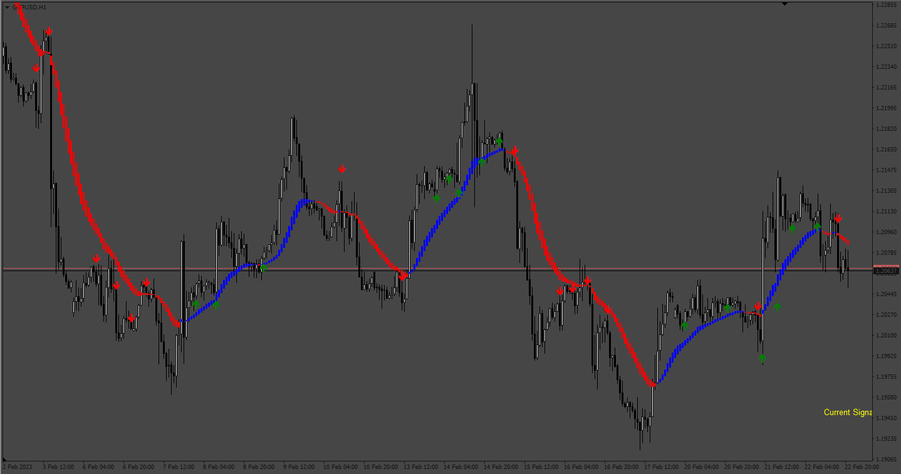
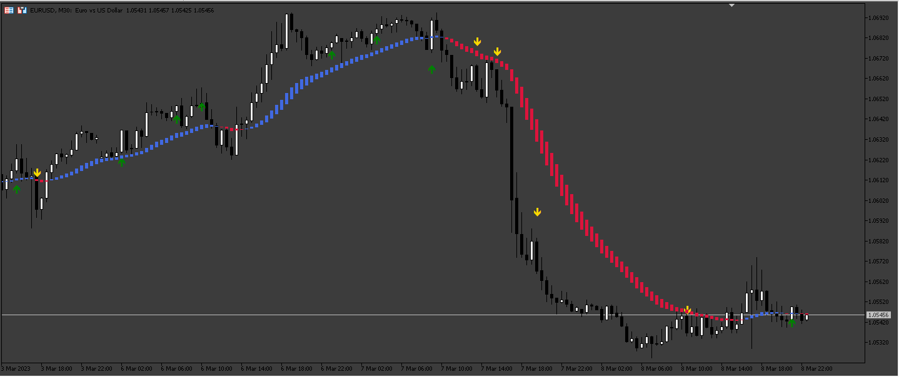
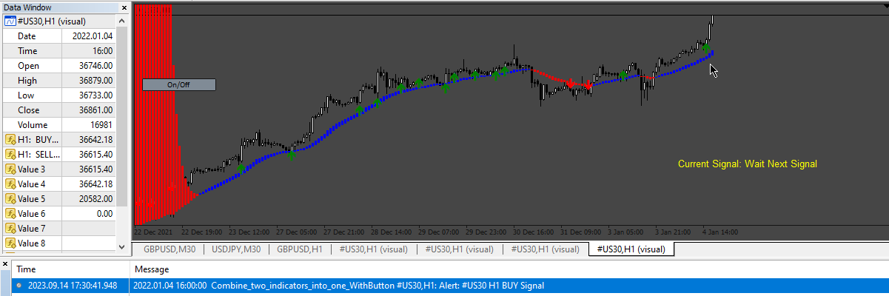
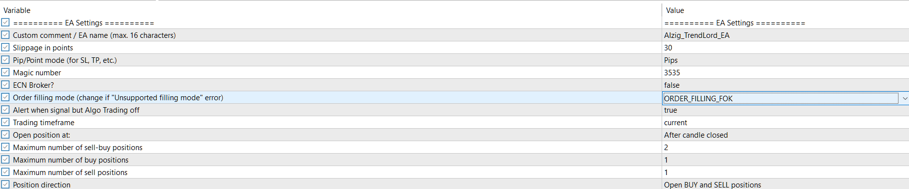

# Combine_two_indicators_into_one

> Source: https://fxcodebase.com/code/viewtopic.php?f=38&t=73429  
> Forum: 38 · Topic 73429 · 15 post(s)

---

## Combine_two_indicators_into_one

**Apprentice** · Tue Feb 28, 2023 6:05 am

Based on the request.
[https://fxcodebase.com/code/viewtopic.php?f=38&t=73380](https://fxcodebase.com/code/viewtopic.php?f=38&t=73380)

 [AIzig.mq4](files/149810/AIzig.mq4)

 [trend-lord-nrp-indicator.mq4](files/149810/trend-lord-nrp-indicator.mq4)

 [Combine_two_indicators_into_one.mq4](files/149810/Combine_two_indicators_into_one.mq4)

 

 [AIzig.mq5](files/149810/AIzig.mq5)

 [TrendLord.mq5](files/149810/TrendLord.mq5)

 [AIzig_TrendLord.mq5](files/149810/AIzig_TrendLord.mq5)

---

## Re: Combine_two_indicators_into_one

**HestoriiafxInc** · Fri Mar 03, 2023 3:58 pm

Hey coders please turn the combine two Indicators into one to Mt5 (convert )

---

## Re: Combine_two_indicators_into_one

**Apprentice** · Sun Mar 05, 2023 7:02 pm

We have added your request to the development list.
Development reference 221.

---

## Re: Combine_two_indicators_into_one

**Apprentice** · Sat Mar 11, 2023 3:33 am

AIzig_TrendLord.mq5 added.

---

## Re: Combine_two_indicators_into_one

**mhlangak** · Sun Mar 12, 2023 7:26 am

> **Apprentice wrote:**
> AIzig_TrendLord.mq5 added.

The AIzig_TrendLord.mq5 is amazing

Can you please provide us with the EA of the AIzig_TrendLord.mq5 for MT5

Buy and Sell arrows EA with stop loss , take profit, Trailing Stop n step , Ea Start time n end , auto lot size

---

## Re: Combine_two_indicators_into_one

**Apprentice** · Tue Mar 14, 2023 3:17 pm

We have added your request to the development list.
Development reference 247.

---

## Re: Combine_two_indicators_into_one

**Sensible** · Wed Mar 15, 2023 8:57 pm

Hi,

Thanks so much here and excellence job done.

The AIzig_TrendLord.mq4 will be great to trade with and so can you please provide us with the EA of the AIzig_TrendLord.mq4 for MT4 too.

Input Parameters:
A simple input parameters indicated below only should be include:

-Stoploss in pips (True/False)

-TakeProfit in pips (True/False)

-Trailing Stops in pips (True/False)
TSL Initial step:
TSL Step:
TSL Distance:

-BreakEven with Steps (True/False)
BreakEven Trigger:
BreakEven Target:

-Push Notification (Desktop, Mobile, Telegram).

Thanks and God bless you and your teams.

---

## Re: Combine_two_indicators_into_one

**Apprentice** · Mon Mar 20, 2023 11:11 am

We have added your request to the development list.
Development reference 261.

---

## Re: Combine_two_indicators_into_one

**Sensible** · Mon Apr 03, 2023 10:35 am

> **Apprentice wrote:**
> We have added your request to the development list.
> Development reference 261.

Checking on the update.

---

## Re: Combine_two_indicators_into_one

**Mahadeo1806** · Fri Jul 28, 2023 1:22 am

res sir

in Ea ther is grid code but not open order can u guide

how to use

---

## Re: Combine_two_indicators_into_one

**Apprentice** · Sat Sep 16, 2023 3:58 am

 [Combine_two_indicators_into_one_WithButton.mq4](files/152589/Combine_two_indicators_into_one_WithButton.mq4)

---

## Re: Combine_two_indicators_into_one

**Mahadeo1806** · Mon Jan 01, 2024 7:10 am

Please make Ra for Mt5

Please do needful

---

## Re: Combine_two_indicators_into_one

**Apprentice** · Tue Jan 02, 2024 12:38 pm

We have added your request to the development list.
Development reference 6

---

## Re: Combine_two_indicators_into_one

**Apprentice** · Mon Aug 25, 2025 1:51 pm

 [Combine_two_indicators_into_one.mq4](files/160365/Combine_two_indicators_into_one.mq4)

 [Combine_two_indicators_into_one_EA_v1.00.mq4](files/160365/Combine_two_indicators_into_one_EA_v1.00.mq4)

---

## Re: Combine_two_indicators_into_one

**Apprentice** · Wed Aug 27, 2025 6:30 am

the filling mode depends on the broker and the account type, for me it works with this setting: ORDER_FILLING_FOK

 [AIzig_TrendLord_v2.mq5](files/160375/AIzig_TrendLord_v2.mq5)

 [AIzig_TrendLord_EA_v1.00.mq5](files/160375/AIzig_TrendLord_EA_v1.00.mq5)
