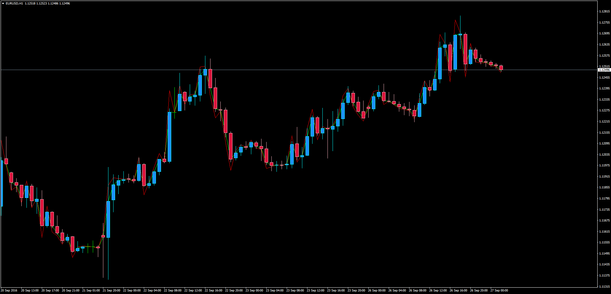

# Compare Prices

> Source: https://fxcodebase.com/code/viewtopic.php?f=38&t=63908  
> Forum: 38 · Topic 63908 · 1 post(s)

---

## Compare Prices

**Apprentice** · Tue Sep 27, 2016 11:25 am

Compare Prices

LUA Original: [viewtopic.php?f=17&t=2162](https://fxcodebase.com/code/viewtopic.php?f=17&t=2162)

Description:

This is a simple indicator based on the following formula using PRICE_CLOSE and Log Base 10 to Compare Prices:

Main[period] = Price[period];
Log[period] = Price[period] /(1+ Math.Log10(Price[period-shift]/Price[period]));

This indicator leaves the door open to work with the same concept using other type of price and/or Shift/Log properties in the formula.

 [ComparePrices.mq4](files/108293/ComparePrices.mq4)
