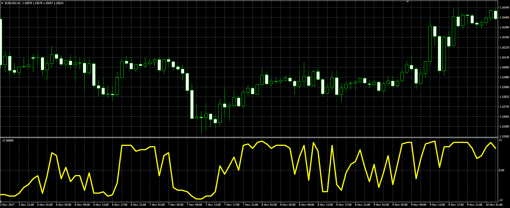

# Composite Indicator

> Source: https://fxcodebase.com/code/viewtopic.php?f=38&t=65404  
> Forum: 38 · Topic 65404 · 7 post(s)

---

## Composite Indicator

**Alexander.Gettinger** · Mon Nov 27, 2017 11:28 am

Original LUA indicator: [viewtopic.php?f=17&t=1708](https://fxcodebase.com/code/viewtopic.php?f=17&t=1708)

 

Download:

 [zzzComposite.mq4](files/116249/zzzComposite.mq4)

For this indicator you need to install the following indicators:

 [AROON.mq4](files/116249/AROON.mq4)

 [ROC.mq4](files/116249/ROC.mq4)

 [supertrend.mq4](files/116249/supertrend.mq4)

 [Frama.mq4](files/116249/Frama.mq4)

 [TMACD.mq4](files/116249/TMACD.mq4)

 [Slope_Direction_Line.mq4](files/116249/Slope_Direction_Line.mq4)

 [KRI.mq4](files/116249/KRI.mq4)

 [Trix.mq4](files/116249/Trix.mq4)

 [WMA.mq4](files/116249/WMA.mq4)

 [KAMA.mq4](files/116249/KAMA.mq4)

 [VORTEX.mq4](files/116249/VORTEX.mq4)

 [DEM.mq4](files/116249/DEM.mq4)

 [forecast.mq4](files/116249/forecast.mq4)

---

## Re: Composite Indicator

**PURABI** · Mon Oct 12, 2020 10:27 am

Please add Muti-symbol and Multi-timeframe of zzzComposite indicator

regards
PB

---

## Re: Composite Indicator

**Apprentice** · Tue Oct 13, 2020 6:05 am

Your request is added to the development list.
Development reference 2181.

---

## Re: Composite Indicator

**PURABI** · Wed Oct 21, 2020 8:19 am

Taking too much time to load.Any solution?

---

## Re: Composite Indicator

**Apprentice** · Thu Oct 22, 2020 1:56 am

Your request is added to the development list.
Development reference 2210.

---

## Re: Composite Indicator

**Apprentice** · Mon Oct 26, 2020 4:42 am

[zzzComposite_ver2.mq4](files/138480/zzzComposite_ver2.mq4)

Try it now.

---

## Re: Composite Indicator

**PURABI** · Mon Oct 26, 2020 11:46 am

only showing few periods
