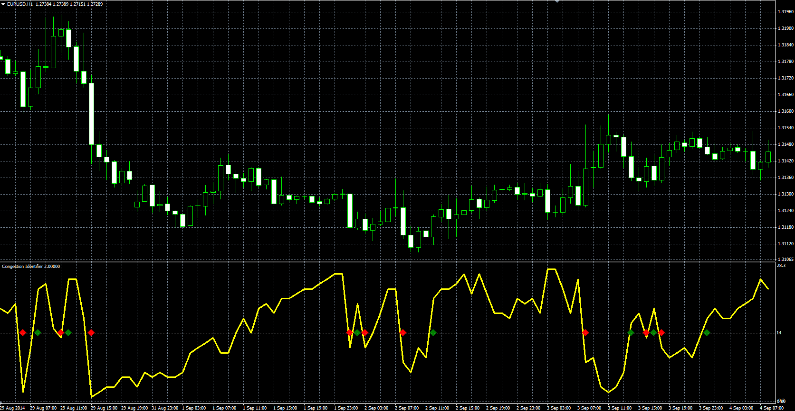

# Congestion Identifier

> Source: https://fxcodebase.com/code/viewtopic.php?f=38&t=61369  
> Forum: 38 · Topic 61369 · 1 post(s)

---

## Congestion Identifier

**Alexander.Gettinger** · Thu Oct 23, 2014 9:52 am

Original LUA oscillator: [viewtopic.php?f=17&t=25314](https://fxcodebase.com/code/viewtopic.php?f=17&t=25314).

> Shows how many times the closing price, in last N periods, was in belt X pips up or down from last close.

 

Download:

 [CI.mq4](files/96704/CI.mq4)
