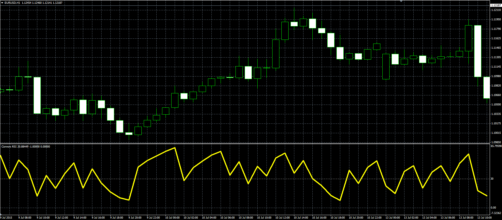

# ConnorsRSI

> Source: https://fxcodebase.com/code/viewtopic.php?f=38&t=62614  
> Forum: 38 · Topic 62614 · 1 post(s)

---

## ConnorsRSI

**Alexander.Gettinger** · Mon Aug 31, 2015 11:40 am

Original LUA oscillator: [viewtopic.php?f=17&t=62518](https://fxcodebase.com/code/viewtopic.php?f=17&t=62518).

ConnorsRSI(3,2,100) = [ RSI(Close,3) + RSI(UpDownDays,2) + PercentRank(percentMove,100) ] / 3

 

Download:

 [Connors_RSI.mq4](files/102103/Connors_RSI.mq4)
