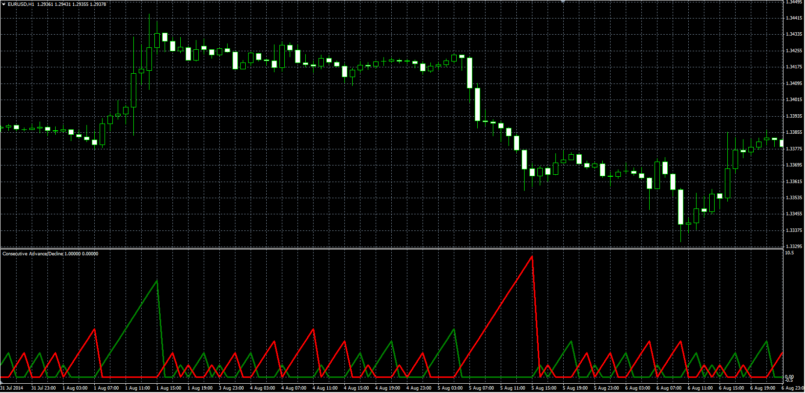

# Consecutive Advance / Decline

> Source: https://fxcodebase.com/code/viewtopic.php?f=38&t=61140  
> Forum: 38 · Topic 61140 · 4 post(s)

---

## Consecutive Advance / Decline

**Alexander.Gettinger** · Fri Sep 12, 2014 5:00 pm

Original LUA oscillator: [viewtopic.php?f=17&t=38887](https://fxcodebase.com/code/viewtopic.php?f=17&t=38887).

 

Download:

 [CAD.mq4](files/95860/CAD.mq4)

---

## Re: Consecutive Advance / Decline

**syncoopate** · Sat Jun 20, 2015 6:34 am

hello Alexander can create an expert mql4 to open long positions or sell if indicator is equal to 1, or 2, or 3 ....
example indicator red = 2 open buy (1/2 / ...... n) lots
example indicator green = 3 open buy (1/2 / ...... n) lots
extern input
N_lots for value indicator up
N_lots for value indicator down
magic number
time for trading hour / day

thank you help me please: D

syncoopate: D

---

## Re: Consecutive Advance / Decline

**Apprentice** · Wed Jun 24, 2015 6:44 am

Your request is added to the development list.

---

## Re: Consecutive Advance / Decline

**Alexander.Gettinger** · Thu Dec 13, 2018 8:01 pm

Please try this strategy:

 [CAD_Str.mq4](files/122811/CAD_Str.mq4)
