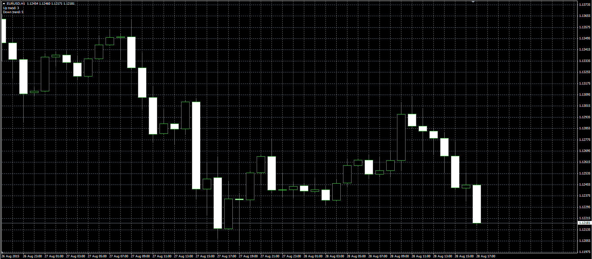

# Consecutive Candle Count

> Source: https://fxcodebase.com/code/viewtopic.php?f=38&t=62613  
> Forum: 38 · Topic 62613 · 1 post(s)

---

## Consecutive Candle Count

**Alexander.Gettinger** · Mon Aug 31, 2015 11:38 am

Original LUA indicator: [viewtopic.php?f=17&t=62503](https://fxcodebase.com/code/viewtopic.php?f=17&t=62503).

> longest consecutive number of up candles
> longest consecutive number of down candles
> If Period is set to Zero All available data is checked.
> otherwise only last N bender is taken into account.

 

Download:

 [Consecutive_Candle_Count.mq4](files/102101/Consecutive_Candle_Count.mq4)
