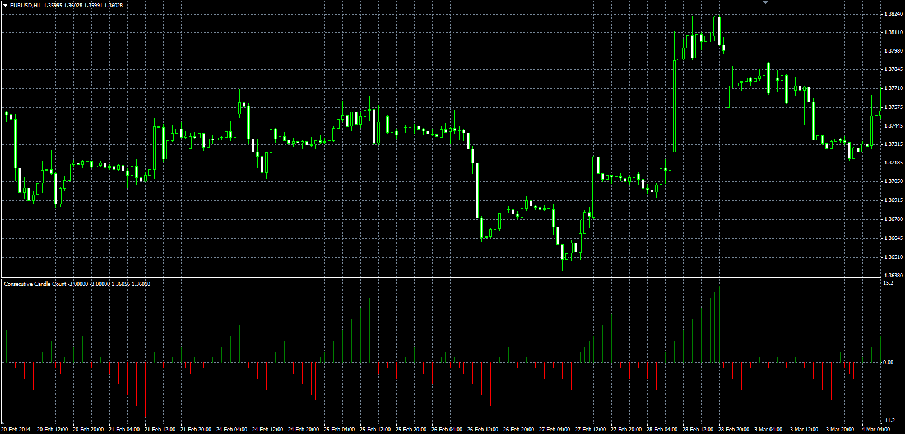
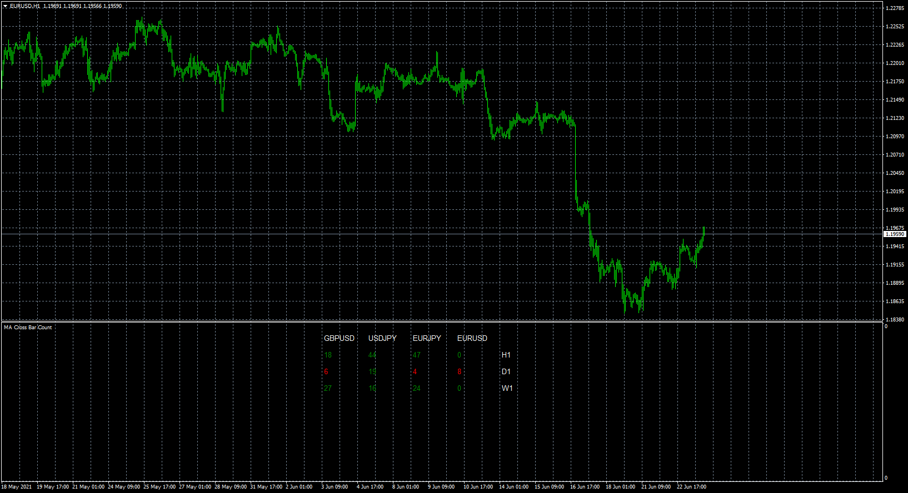
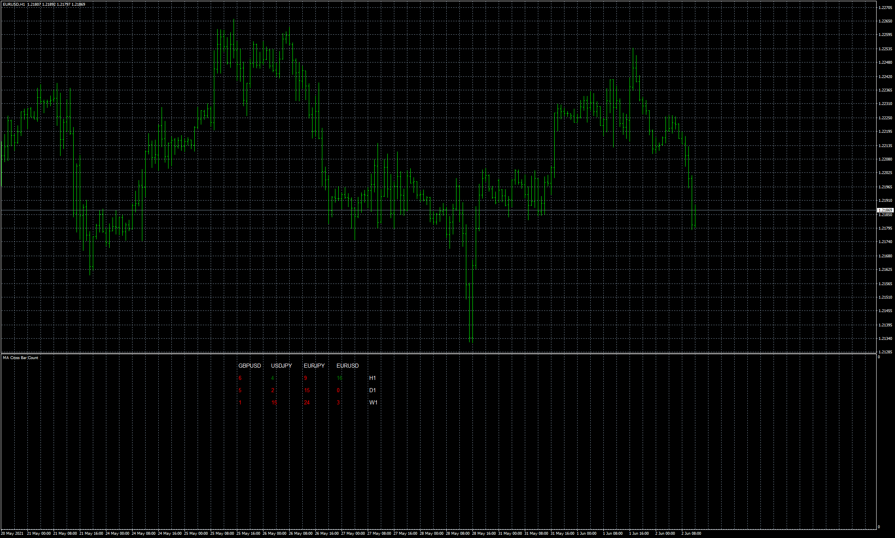
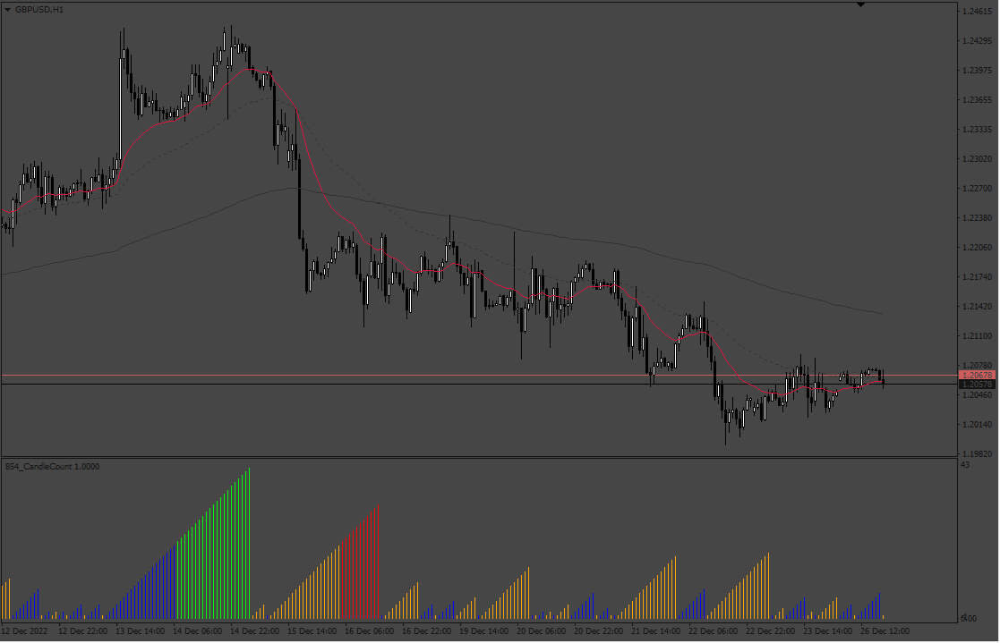
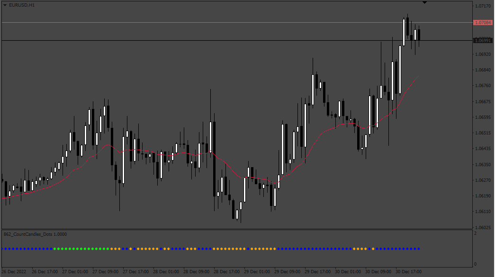

# Consecutive Candle Count

> Source: https://fxcodebase.com/code/viewtopic.php?f=38&t=60775  
> Forum: 38 · Topic 60775 · 25 post(s)

---

## Consecutive Candle Count

**Alexander.Gettinger** · Wed Jun 04, 2014 5:41 pm

Original LUA oscillator: [viewtopic.php?f=17&t=60243](https://fxcodebase.com/code/viewtopic.php?f=17&t=60243).

 

Download:

 [CCC.mq4](files/94318/CCC.mq4)

---

## Re: Consecutive Candle Count

**syncoopate** · Sat Jun 20, 2015 6:38 am

hello Alexander can create an expert mql4 to open long positions or sell if indicator is equal to 1, or 2, or 3 ....
example indicator red = 2 open buy (1/2 / ...... n) lots
example indicator green = 3 open buy (1/2 / ...... n) lots
extern input
N_lots for value indicator up
N_lots for value indicator down
magic number
time for trading hour / day

thank you help me please: D

syncoopate: D

---

## Re: Consecutive Candle Count

**Apprentice** · Wed Jun 24, 2015 6:41 am

Your request is added to the development list.

---

## Re: Consecutive Candle Count

**Alexander.Gettinger** · Thu Dec 13, 2018 8:00 pm

Please try this strategy:

 [CCC_Str.mq4](files/122810/CCC_Str.mq4)

---

## Re: Consecutive Candle Count

**evansrono** · Thu Jun 17, 2021 7:34 am

Hi,

Could you create a dashboard with a Candle Count based on Moving average period. ie.

Long - Total sum of Candles in Range - (START) Last Candle Closed above MA to (MID) Candle Closed below MA to (END) Current Closed candle (both START and END candles included in the count).

Short - Total sum of Candles in Range - (START) Last Candle Closed below MA to (MID) Candle Closed above MA to (END) Current Closed candle (both START and END candles included in the count).

All counts must have the MID.

Dashboard to show the results of total candles in range with MTF in different color codes

Column - MTF (with option to remove certain timeframes from dashboard),
Row - Long and Short
Dashboard size and position adjustment.

The MA to include all the usual MA input features (Period, Method, Price Type, etc)
 All candle count results in MTF to change according to adjustment to MA Period, Method and Price Type.

Your Assistance on this is highly appreciated.

Regards

---

## Re: Consecutive Candle Count

**Apprentice** · Fri Jun 18, 2021 4:43 am

Your request is added to the development list.
Development reference 582.

---

## Re: Consecutive Candle Count

**Apprentice** · Wed Jun 23, 2021 9:38 am

 [MA_Cross_Bar_Count_Dashboard.mq4](files/142587/MA_Cross_Bar_Count_Dashboard.mq4)

---

## Re: Consecutive Candle Count

**evansrono** · Wed Jun 23, 2021 5:51 pm

Hi Apprentice,

Thanks for the help. The indicator seems to be counting candles from 2 MA crosses. Please see the image below for details.

Vice versa for going Short.

Regards

---

## Re: Consecutive Candle Count

**Apprentice** · Fri Jun 25, 2021 4:59 am

Your request is added to the development list.
Development reference 596.

---

## Re: Consecutive Candle Count

**Apprentice** · Tue Jul 06, 2021 3:02 am

I don't understand why we need two MA?

---

## Re: Consecutive Candle Count

**evansrono** · Tue Jul 06, 2021 4:35 am

Hi,

No. Do not put two MA. Just that one MA as illustrated.

Thanks.

---

## Re: Consecutive Candle Count

**Apprentice** · Tue Jul 06, 2021 7:56 am

Your request is added to the development list.
Development reference 616.

---

## Re: Consecutive Candle Count

**Apprentice** · Thu Jul 08, 2021 11:14 am

Try this version.

 [MA_Price_Cross_Bar_Count_Dashboard.mq4](files/142752/MA_Price_Cross_Bar_Count_Dashboard.mq4)

---

## Re: Consecutive Candle Count

**evansrono** · Tue Jul 13, 2021 1:13 pm

Hi,

Sorry sent my reply to the wrong topic, Set Stop Loss Take Profit For All.

The count is not accurate. From the EURUSD example, the count for gong long should be 24 closed candles not 5.

The Row for going short is not showing, on which the count should be 25 closed candles.

Regards

---

## Re: Consecutive Candle Count

**Apprentice** · Thu Jul 15, 2021 1:25 pm

Your request is added to the development list.
Development reference 648.

---

## Re: Consecutive Candle Count

**Sufiki** · Thu Aug 26, 2021 7:29 pm

> **Apprentice wrote:**
> Your request is added to the development list.
> Development reference 648.

any update with this, also facing same problem

---

## Re: Consecutive Candle Count

**Stomp2k** · Fri Dec 23, 2022 3:47 pm

Can you show me how to add a line of code or function for a third color?
"x" = a specific bar count input by user (i.e. 250) bars
Suppose a bar count above ma cross, count is green, then if count is > "x" above ma cross then it will be bright green or lime.
and a bar count below ma cross, count is red, then if count is > "x" below ma cross then it will be bright red or magenta.

TIA

---

## Re: Consecutive Candle Count

**Apprentice** · Sat Dec 24, 2022 4:34 am

We have added your request to the development list.
Development reference 854.

---

## Re: Consecutive Candle Count

**Apprentice** · Wed Dec 28, 2022 12:28 pm

Three-color version.

 [CandleCount.mq4](files/148826/CandleCount.mq4)

---

## Re: Consecutive Candle Count

**Josan70** · Thu Dec 29, 2022 12:36 pm

Hello, good afternoon. I wanted to ask you if it would be possible to pass this indicator instead of a histogram to points including the same colors that the histogram indicator has but in points similar to the one in the photo that I am going to add.

Thanks a lot .

---

## Re: Consecutive Candle Count

**Apprentice** · Fri Dec 30, 2022 4:04 am

We have added your request to the development list.
Development reference 862.

---

## Re: Consecutive Candle Count

**Apprentice** · Sat Jan 14, 2023 4:03 am

 [CountCandles_Dots.mq4](files/149089/CountCandles_Dots.mq4)

---

## Re: Consecutive Candle Count

**Teruyoshi** · Thu Nov 27, 2025 5:14 am

I have one request on MA_Cross_Bar_Count_Dashboard.mq4
When the window gets samll, the dashboard gets out of sight.
I once asked AI to modify this, but it ends in vain, which means errors happend.
So, Could you modify this mattter as in other dashboards?
Thanks a million.

---

## Re: Consecutive Candle Count

**Apprentice** · Sat Nov 29, 2025 11:43 am

We have added your request to the development list.
Development reference 752

---

## Re: Consecutive Candle Count

**Apprentice** · Mon Dec 29, 2025 7:21 am

[MA_Price_Cross_Bar_Count_Dashboard.mq4](files/161435/MA_Price_Cross_Bar_Count_Dashboard.mq4)
