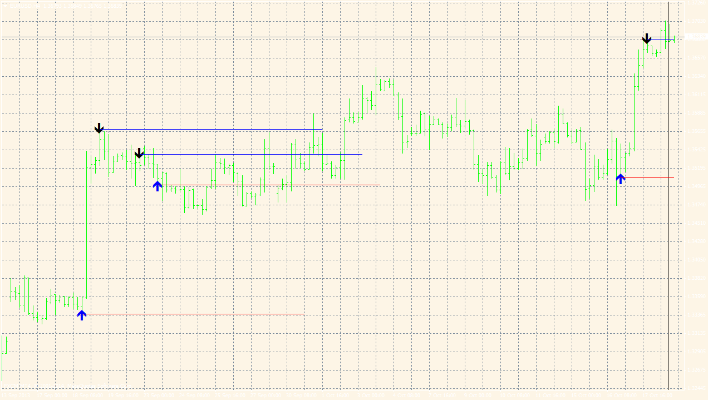

# Consecutive candle range

> Source: https://fxcodebase.com/code/viewtopic.php?f=38&t=60891  
> Forum: 38 · Topic 60891 · 2 post(s)

---

## Consecutive candle range

**Apprentice** · Fri Jul 11, 2014 9:39 am

Based on requests
[viewtopic.php?f=27&t=60881](https://fxcodebase.com/code/viewtopic.php?f=27&t=60881)

Will draw the line on Min / Max Level for a series of at least N Up/Down candles.
By default N is set to 5

 [Consecutive candle range.mq4](files/94845/Consecutive%20candle%20range.mq4)

---

## Re: Consecutive candle range

**Apprentice** · Mon May 30, 2022 11:51 am

Updated.
