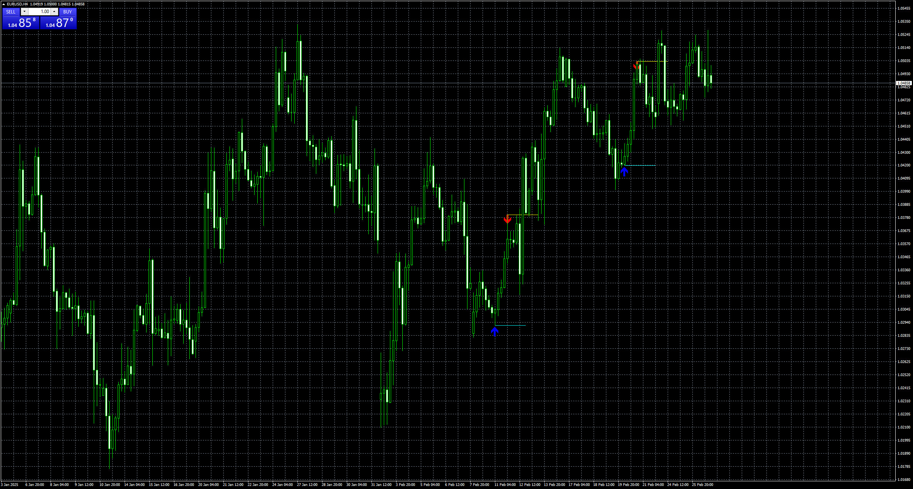
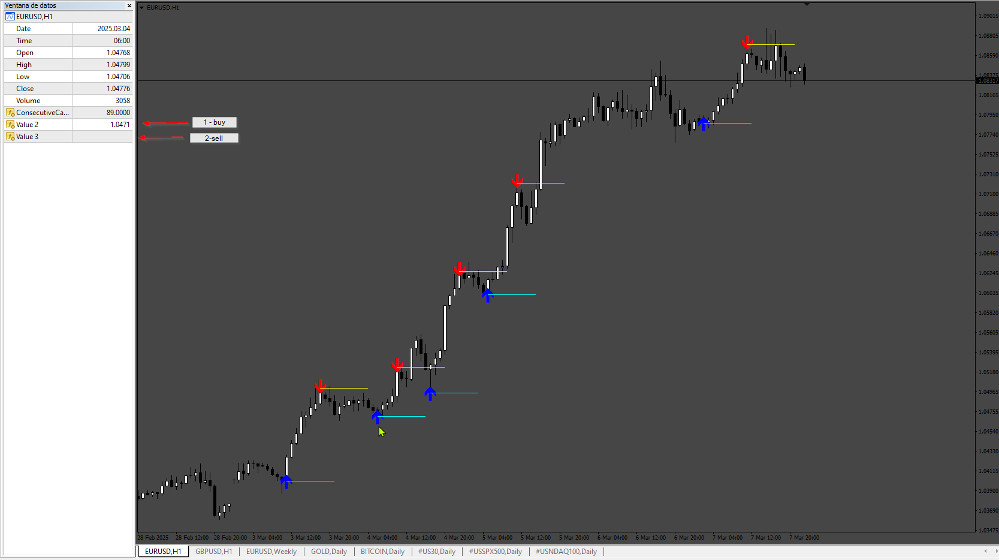
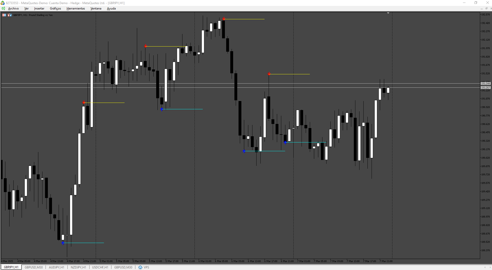

# ConsecutiveCandle

> Source: https://fxcodebase.com/code/viewtopic.php?f=38&t=75651  
> Forum: 38 · Topic 75651 · 3 post(s)

---

## ConsecutiveCandle

**Apprentice** · Wed Feb 26, 2025 3:13 pm

Based on the request.
[https://fxcodebase.com/code/viewtopic.php?f=27&p=158290](https://fxcodebase.com/code/viewtopic.php?f=27&p=158290)

 [ConsecutiveCandle_v3.mq4](files/158423/ConsecutiveCandle_v3.mq4)

 [ConsecutiveCandle_v3.mq5](files/158423/ConsecutiveCandle_v3.mq5)

---

## Re: ConsecutiveCandle

**Dan19900** · Thu Feb 27, 2025 5:03 am

Can you please tell me what is the arrows buffers ?

---

## Re: ConsecutiveCandle

**Apprentice** · Mon Mar 10, 2025 1:42 pm

 

 [ConsecutiveCandle_v3.mq4](files/158546/ConsecutiveCandle_v3.mq4)

 [ConsecutiveCandle_v3.mq5](files/158546/ConsecutiveCandle_v3.mq5)
