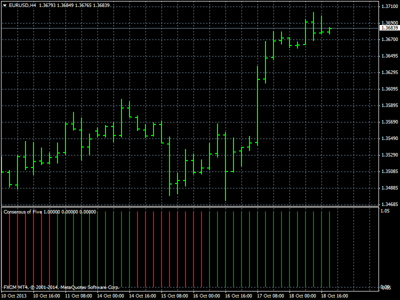

# Consensus of Five

> Source: https://fxcodebase.com/code/viewtopic.php?f=38&t=61082  
> Forum: 38 · Topic 61082 · 4 post(s)

---

## Consensus of Five

**Apprentice** · Thu Aug 28, 2014 12:16 pm

This indication is obtained as Consensus of all selected (five) indicators.

green color:
1. cci > buy level
2. macd > buy level
3. adx > entry level and adx < exit level
4. dmi positive > dmi negative
5. stochastic k> stochastic d and d< ob level

red color:
1. cci < sell level
2. macd < sell level
3. adx > entry level and adx < exit level
4. dmi positive < dmi negative
5, stochastic k< d and d > os level

else
siver

 [Consensus of Five.mq4](files/95615/Consensus%20of%20Five.mq4)

---

## Re: Consensus of Five

**SavvyStrategist** · Sat Aug 13, 2016 8:34 pm

Sounds promising, could we get a Trading Station version as well?

---

## Re: Consensus of Five

**Apprentice** · Mon Aug 15, 2016 2:21 am

Can you define, specify the Trading Station?
TS2/Marketscope version is available here.
[viewtopic.php?f=17&t=27184&hilit=Consensus+of+Five](http://www.fxcodebase.com/code/viewtopic.php?f=17&t=27184&hilit=Consensus+of+Five)

---

## Re: Consensus of Five

**SavvyStrategist** · Mon Aug 15, 2016 5:15 am

My bad, thanks a lot then
