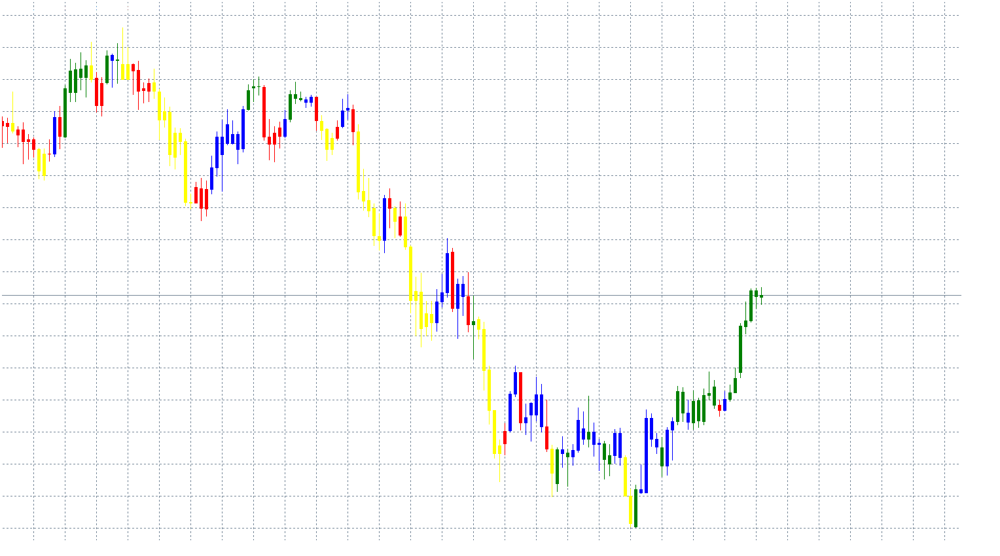

# Coordinated ADX and MACD indicator

> Source: https://fxcodebase.com/code/viewtopic.php?f=38&t=66201  
> Forum: 38 · Topic 66201 · 2 post(s)

---

## Coordinated ADX and MACD indicator

**Apprentice** · Sun Jun 17, 2018 4:39 am

As described in the article “The CAM Indicator For Trends And Countertrends”
by Barbara Star. January 2018 Issue of S&C Magazin.

Based on lua original.
[viewtopic.php?f=17&t=65462](https://fxcodebase.com/code/viewtopic.php?f=17&t=65462)

 [CAM Indicator.mq4](files/119594/CAM%20Indicator.mq4)

---

## Re: Coordinated ADX and MACD indicator

**nicetees** · Sun Jun 17, 2018 8:01 am

Thank you Sir and have yourself a great weekend!
