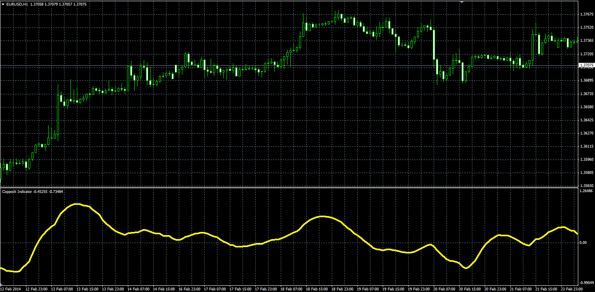

# Coppock Indicator

> Source: https://fxcodebase.com/code/viewtopic.php?f=38&t=60491  
> Forum: 38 · Topic 60491 · 1 post(s)

---

## Coppock Indicator

**Alexander.Gettinger** · Thu Apr 03, 2014 12:26 pm

Original LUA indicator: [viewtopic.php?f=17&t=1225&p=9796](https://fxcodebase.com/code/viewtopic.php?f=17&t=1225&p=9796).

Formula:
Coppock = LWMA (ROC[Short_Length]+ROC[Long_Length]).

 

Download:

 [Coppock.mq4](files/93355/Coppock.mq4)

For this indicator must be installed ROC oscillator ([viewtopic.php?f=38&t=59967&p=91101](https://fxcodebase.com/code/viewtopic.php?f=38&t=59967&p=91101)).
