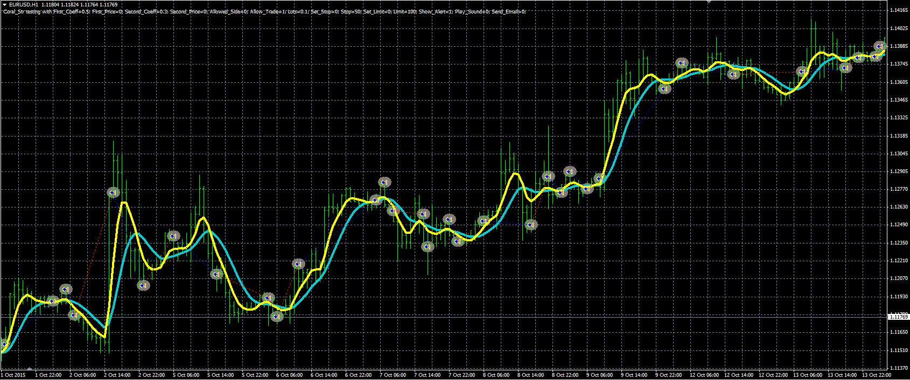

# Coral indicator strategy

> Source: https://fxcodebase.com/code/viewtopic.php?f=38&t=63299  
> Forum: 38 · Topic 63299 · 1 post(s)

---

## Coral indicator strategy

**Alexander.Gettinger** · Fri Mar 25, 2016 4:38 pm

The strategy based on Coral indicator ([viewtopic.php?f=38&t=63069&p=104424](https://fxcodebase.com/code/viewtopic.php?f=38&t=63069&p=104424)).

Buy condition: the Coral1 crosses over the Coral2.
Sell condition: the Coral1 crosses under the Coral2.

 

Download:

 [Coral_Str.mq4](files/105478/Coral_Str.mq4)

The Coral indicator ([viewtopic.php?f=38&t=63069&p=104424](https://fxcodebase.com/code/viewtopic.php?f=38&t=63069&p=104424)) should be installed for correct work.
