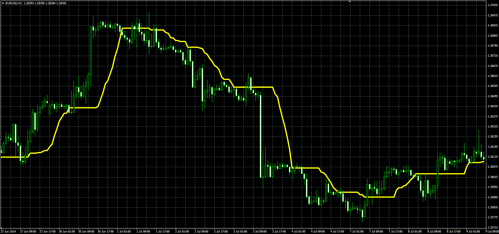

# Corrected Average

> Source: https://fxcodebase.com/code/viewtopic.php?f=38&t=61251  
> Forum: 38 · Topic 61251 · 1 post(s)

---

## Corrected Average

**Alexander.Gettinger** · Thu Sep 25, 2014 9:36 am

Original LUA indicator: [viewtopic.php?f=17&t=27589](https://fxcodebase.com/code/viewtopic.php?f=17&t=27589).

Formula:
CA[i] = CA[i-1]+k*(MA-CA[i-1]), where
MA - MA(Price) with [Length] number of periods and [Method] type,
k = 1-StdDev2/diff2, if diff2>StdDev2, else k = 0,
StdDev2 = StdDev*StdDev,
StdDev - Standard deviation(Price) with [Length] number of periods,
diff2 = diff*diff,
diff = CA[i-1]-MA.

 

Download:

 [CA.mq4](files/96193/CA.mq4)
