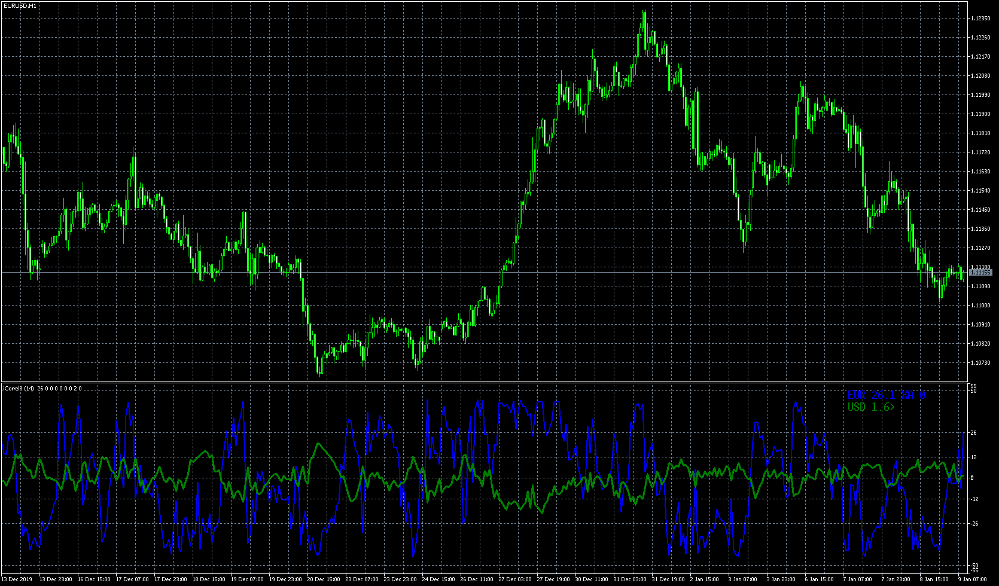

# correl8b_TRO_MODIFIED

> Source: https://fxcodebase.com/code/viewtopic.php?f=38&t=69872  
> Forum: 38 · Topic 69872 · 12 post(s)

---

## correl8b_TRO_MODIFIED

**Apprentice** · Mon May 18, 2020 7:53 am

Based on request.
[viewtopic.php?f=27&t=69827](https://fxcodebase.com/code/viewtopic.php?f=27&t=69827)

 [correl8b_TRO_MODIFIED.mq5](files/134037/correl8b_TRO_MODIFIED.mq5)

---

## Re: correl8b_TRO_MODIFIED

**rubbbo** · Wed May 20, 2020 5:07 am

Thank you so much Apprentice!
Thank you for helping..

I will test it as soon as possible!

Best regards!
Rub

---

## Re: correl8b_TRO_MODIFIED

**rubbbo** · Wed May 27, 2020 3:41 pm

Dear Appretice

Could you please modify the indi in order to be able of changing the calculation period in the parameters box? It is fixed to 14

Could you also include a parameter to set number of past bars for the indicator to show in the graph, it´s useful for checking the indi behaviour for longer periods of time and also test if mt5 instance suffers with the calculations of this indicator loaded on a few charts and we can limit the overoad by limiting number of past bars

Thank you so much for the help and effort
Best regards!
Rub

---

## Re: correl8b_TRO_MODIFIED

**Apprentice** · Wed May 27, 2020 4:02 pm

Your request is added to the development list.
Development reference 1380.

---

## Re: correl8b_TRO_MODIFIED

**rubbbo** · Tue Jun 02, 2020 7:17 am

Dear Apprentice

Thank you very much for teh update!
It´s working perfectly!

Best regards!
Rub

---

## Re: correl8b_TRO_MODIFIED

**rubbbo** · Fri Jul 10, 2020 6:32 am

Dear Apprentice

Could be possible to create an indicator that shows sell and buy arrows each time that currency lines for three different timeframes are alligned? for instance the gold line is above usd line on every TF will show a buy arrow, the opossite for sell. The same for every currency pair

to simplify, every timeframe will have the same period, iprice, rangemode

I attach a pic in order to explain myself better

 

 

Thank you very much for your help and attention

Best regards

---

## Re: correl8b_TRO_MODIFIED

**Apprentice** · Sat Jul 11, 2020 4:05 pm

Your request is added to the development list.
Development reference 1670.

---

## Re: correl8b_TRO_MODIFIED

**rubbbo** · Sat Jul 11, 2020 4:08 pm

Dear Apprentice

Thank you very much

Best regards

---

## Re: correl8b_TRO_MODIFIED

**rubbbo** · Mon Jul 13, 2020 10:51 am

Dear Apprentice

I noted that after using the indicator o more than one icorr_mod_tro in the chart, they tend to not refresh after some time.. and the give the results for past bars as stright line.

I attach picture

 

Thank you for your help and attention
best regads!

---

## Re: correl8b_TRO_MODIFIED

**Apprentice** · Fri Aug 07, 2020 5:27 am

Your request is added to the development list.
Development reference 1859.

---

## Re: correl8b_TRO_MODIFIED

**Apprentice** · Tue Aug 11, 2020 3:54 am

Try it now.

---

## Re: correl8b_TRO_MODIFIED

**rubbbo** · Fri Aug 14, 2020 10:42 am

Dear Apprentice

Thank you very much.. it works much better now.

Best regards
