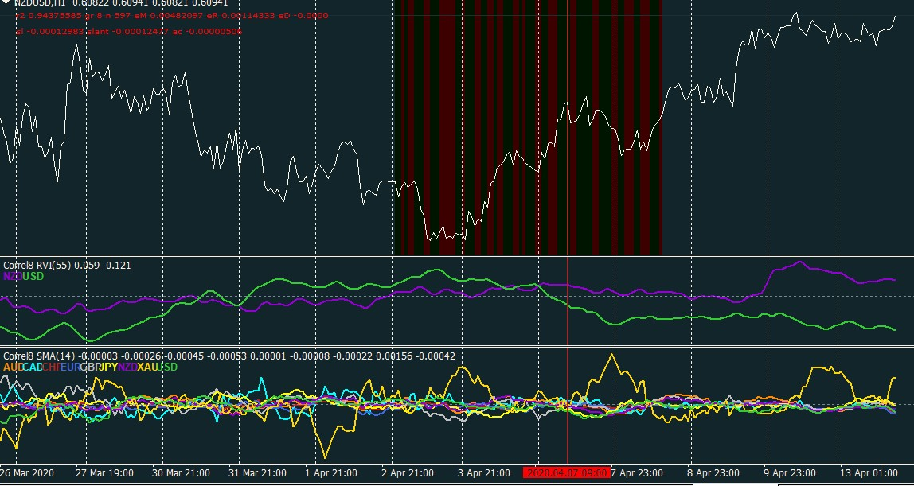

# Correlate indicator MTF

> Source: https://fxcodebase.com/code/viewtopic.php?f=38&t=69667  
> Forum: 38 · Topic 69667 · 7 post(s)

---

## Correlate indicator MTF

**rubbbo** · Mon Apr 13, 2020 1:22 pm

HI coders!

Please would it be possible to make the attached indicators Multi Frame?

 

looking at the code I cannot see what buffers should be used to create a signal every time one of the lines crosses the other or if one of the lines stays above or below the other.

Would you please be able to make those buffers for every one of the 8 lines?

Attaching mq4 and mq5 versions

Thank you so much!
Rub

 [Correlate.mq4](files/132834/Correlate.mq4)

 [Correlate.mq5](files/132834/Correlate.mq5)

 [OnTick.mq4](files/132834/OnTick.mq4)

 [OnTick.mq5](files/132834/OnTick.mq5)

---

## Re: Correlate indicator MTF

**Apprentice** · Tue Apr 14, 2020 11:03 am

Your request is added to the development list.
Development reference 1065.

---

## Re: Correlate indicator MTF

**Apprentice** · Tue Apr 21, 2020 9:56 am

[Correlate MTF.mq4](files/133025/Correlate%20MTF.mq4)

---

## Re: Correlate indicator MTF

**rubbbo** · Wed Apr 22, 2020 4:46 am

> **Apprentice wrote:**
>
>
> Correlate MTF.mq4

Thank you so much Apprentice for your hard work!
I´m going to test it and give feedback to you

Best regards!
Rub

---

## Re: Correlate indicator MTF

**rubbbo** · Wed Apr 22, 2020 5:46 am

Hello again Apprentice

Could you please add label text showing the type of indicator used for calculation as the Correlate original does?, and also the Timeframe for each Correlate MTF displayed ?

Please see pic attached

 

I want to thank you again for your great work here!

Best Regards!
Rub

---

## Re: Correlate indicator MTF

**Apprentice** · Wed Apr 22, 2020 10:32 am

Your request is added to the development list.
Development reference 1105.

---

## Re: Correlate indicator MTF

**Apprentice** · Thu Apr 23, 2020 4:43 am

[Correlate MTF.mq4](files/133103/Correlate%20MTF.mq4)

Try this version.
