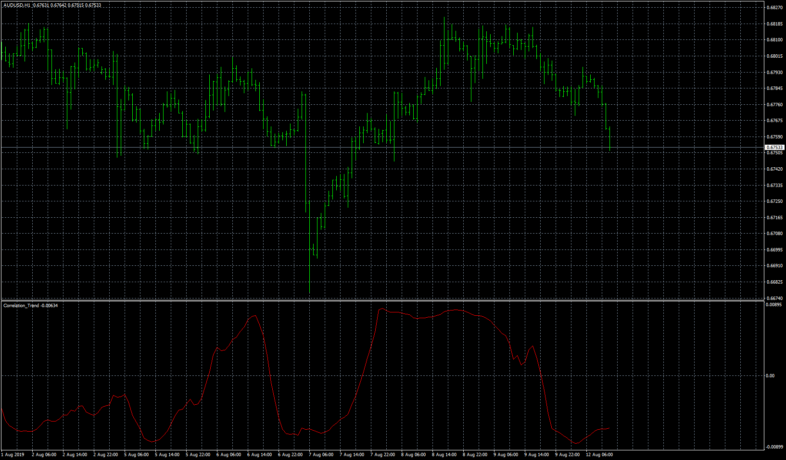
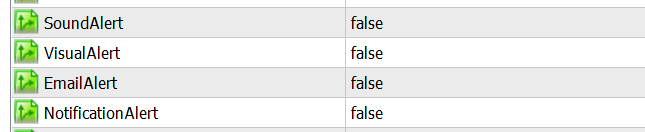
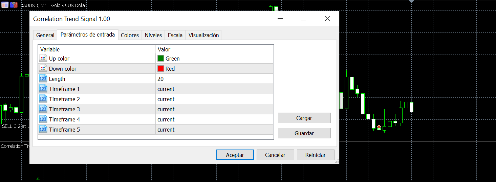

# Correlation_Trend

> Source: https://fxcodebase.com/code/viewtopic.php?f=38&t=69871  
> Forum: 38 · Topic 69871 · 24 post(s)

---

## Correlation_Trend

**Apprentice** · Mon May 18, 2020 7:41 am

TS2/Lua version.
[viewtopic.php?f=17&t=69817](https://fxcodebase.com/code/viewtopic.php?f=17&t=69817)

 [Correlation_Trend.mq4](files/134034/Correlation_Trend.mq4)

 [Correlation_Trend.mq5](files/134034/Correlation_Trend.mq5)

---

## Re: Correlation_Trend

**rubbbo** · Wed Jul 22, 2020 6:26 am

Dear Apprentice

Thank you very much for this tool

May you please code a Multi Timefrace for MT5?

thank you very much

Best regards!

---

## Re: Correlation_Trend

**Apprentice** · Wed Jul 22, 2020 7:18 am

As dashboard or as it is, with a higher time frame option?

---

## Re: Correlation_Trend

**rubbbo** · Thu Jul 23, 2020 10:54 am

Dear Apprentice

I first thought to have the indicator with the option of choosing the timeframe different from the current one to see if indicator is above zero for buy or below zero to sell and load different timeframes of the indicator to see when all meet the criteria of being above or below but maybe it´s more helpfull to have a dashboard ( with the option of locate it in the chart varying the X and Y coordinates
and be able of select or unselect all or some TimeFrames from M1 to Month and get a signal (arrow or dot) when all the Timeframe are above to buy and the opposite for selling , when bar is closed in the current chart

Thank you very much for your unvaluable help and effort

best regards!

---

## Re: Correlation_Trend

**rubbbo** · Fri Jul 24, 2020 5:13 am

Dear Apprentice

I hadn´t thought using your indi as a dashboard But after your question I think it could be a good idea to have a dashboard where we can select the active TimeFrames that may appear

maybe I´m on M5 and I want te dashboard to show indicator for M5. 1H.1D or I want it all except 1W and 1MONTH, this is only an example...

I guess that the dashboard will show arrows up or down for every TF shown on it

My idea of using your indicator is that when all the timeframes are above 0 an arrow or dot up is shown when current bar is closed in the current Timeframe and a message pops up (may be it good to be able of have this on and off ) and the opposite for sell, when all TF are below 0

It could be nice also to be able of modified the location of the dashboard varying XY coordinates. i.e we could use more than 1 dashboard when modifying the length parameter

Hope I have explained clearly

Thank you very much for your effort and attention
Regards!

---

## Re: Correlation_Trend

**Apprentice** · Fri Jul 24, 2020 7:32 am

Your request is added to the development list.
Development reference 1763.

---

## Re: Correlation_Trend

**Apprentice** · Tue Jul 28, 2020 3:26 pm

[Correlation Trend Signal.mq5](files/136371/Correlation%20Trend%20Signal.mq5)

 [Correlation_Trend.mq5](files/136371/Correlation_Trend.mq5)

Something like this?

---

## Re: Correlation_Trend

**rubbbo** · Wed Jul 29, 2020 5:46 am

Dear @Apprentice

Thank you for your hard work!

I noted that no past arrows are shown in the Correlation trend signal indicator.

I attach some pics to better explain:

the line at a certain time at M1 M5 M15 and H1 is always below 0 so a red arrow might appear..

 

*m1*

 

*m5*

 

*m15*

 

I attach a final pic that not shows arrows nor indicator name on the window

 

Thank you again for your help and effort!
Regards

---

## Re: Correlation_Trend

**Apprentice** · Thu Jul 30, 2020 4:37 pm

Only Correlation Trend Signal.mq5 draw arrows

---

## Re: Correlation_Trend

**rubbbo** · Fri Aug 07, 2020 5:08 am

*if we change a timeframe no past signals are shown*

> **Apprentice wrote:**
> Only Correlation Trend Signal.mq5 draw arrows

Dear Apprentice

I did not realise about your replay..
What I meant is that i cannot see past signals...
I attach two pics for better understanding

 

*if all the timeframes are the same..it gives signal and signals stay on the chart*

 

Thank you so much
Best regards

---

## Re: Correlation_Trend

**rubbbo** · Sun Aug 09, 2020 7:16 am

Dear Apprentice

Please forget about the last message. What happens is we need to refresh manually the chart for the indi to show after some seconds. I guess it requires time to make the calculations. Maybe you could check the code to make the indicator to auto refresh or something similar if this makes sense to you

Thank you very much for your help and effort

Regards!

---

## Re: Correlation_Trend

**rubbbo** · Sun Aug 09, 2020 7:59 am

Dear Apprentice

I forgot to mention if its possbe to add an alert signal when arrow appear?

Thank you so much

Best regards!

---

## Re: Correlation_Trend

**Apprentice** · Mon Aug 10, 2020 4:07 am

Your request is added to the development list.
Development reference 1865.

---

## Re: Correlation_Trend

**Apprentice** · Tue Aug 11, 2020 4:14 am

It already has signals.

---

## Re: Correlation_Trend

**rubbbo** · Tue Aug 11, 2020 5:08 am

Dear Apprentice

I meant to have the possibility of activate the alert like this:

 

to be added to the parameter windows

 

 so we can receive pop up alert when condtions are met

Thank you very much

Regards!

---

## Re: Correlation_Trend

**Apprentice** · Wed Aug 12, 2020 4:41 am

Your request is added to the development list.
Development reference 1874.

---

## Re: Correlation_Trend

**Apprentice** · Thu Sep 03, 2020 2:21 am

Try this version.

 [Correlation Trend Signal.mq5](files/137266/Correlation%20Trend%20Signal.mq5)

---

## Re: Correlation_Trend

**rubbbo** · Fri Sep 04, 2020 3:36 am

Dear Apprentice

Thank you for your hard work!!

Some thoughts

1.- I've noted that signal pops up when candle starts forming, not when candle is closed, which would be the ideal

2.- this version is located in the main window instead of a separate window like the previous version, I would prefer to have it in a separate window like previous one so it´s easier to set different parameter and timeframes to compare

3.- both versions do not show arrows if parameter is set to 3, I checked more numbers and indicator works fine

Finally I would ask, when possible, and if possible, of having the possibility to add 2 level lines dependent on the numbers on the right which also dependent on the zoom level in the main window. the idea is to have like an oversold and overbought areas .

 

In the pic uploaded we can see two lines one at 30% and another to 70%, this levels can be modified by user, so if a green arrow is located in or below 30% it will show up.
Red arrow will appear if is located above or in the 70% line. Where 0 an 100 would be the botton and upper numbers shown on the right of the windows, 1932, 06 and 1938, 24 in this example

Obviously this levels will vary as price is moving in the main windows, changing those 0 ad 100% limits..

Thank you again for your help and attention
Regards!

---

## Re: Correlation_Trend

**Apprentice** · Sat Sep 05, 2020 3:58 am

Your request is added to the development list.
Development reference 1981.

---

## Re: Correlation_Trend

**Apprentice** · Wed Sep 09, 2020 4:48 am

[Correlation Trend Signal.mq5](files/137470/Correlation%20Trend%20Signal.mq5)

OS/OB requirements don't make any sense to me. I don't understand why you need that and how it should work. And I don't understand what should I set to 3 in order to replicate a but with no arrows.

---

## Re: Correlation_Trend

**rubbbo** · Wed Sep 09, 2020 2:45 pm

Dear Apprentice

Thanks for your hard work!

Regarding to parameter set to 3: I meant that if I choose 3 for the parameter indicator do not show ny arrow at all, it´s not working, If a choose 2, 4 .5 ...20..51.. any other number indicator shows the arrrows. It´s like a bug , I do not know why. But it's not a big problem because i don't use the number 3 as parameter...

Regarding to the OB-OS levels, maybe I did not explain myself clearly..
those levels related to the numbers shown on the right at a certain time, would be the 70% or 30% of the distance between the bottom and upper number... being 100% the upper number and 0% the bottom one.. those lines will vary any time price goes up or down of those limits.. It would be like floating levels.. always respecting the 70% and 30% ( or any number between 0 and 100 you may use,,,)

The reason behind this is that your indi shows the correlation of the trend and if an red arrow is appearing in the upper zone, this might indicate a possible retracement. because if the trend continues a green arrow would appear in the upper zone.. obviously there is no guarantee of this retracement will occur,
The opposite happens with green arrows showing below lower level..

I attach a pic in order to clarify this..

 

1449,50 is 100% and 0% is located at 1944, 57 so 4,93 is the difference so a line at 70% would be located at 3,45 above 1944,57 , 1948,02 and a line at 30%, would be located at 1.47 upper of the 0% line, at 1946,5.. so if the bearish arrow appears above the upper level , alert pops up and if a bullish arrow appear below the lower level, the alert would pop up, in order to not be hours and hours in front of the computer..

that was the reason to ask it to you... and I understand you don't want to consume a lot of time in this..**ou´ve helped with this indicator a lot**

Thank you so much!
Best regards!

---

## Re: Correlation_Trend

**Apprentice** · Thu Sep 10, 2020 1:29 am

Your request is added to the development list.
Development reference 2006.

---

## Re: Correlation_Trend

**Apprentice** · Thu Sep 10, 2020 4:58 am

> Regarding to the OB-OS levels, maybe I did not explain myself clearly..
> those levels related to the numbers shown on the right at a certain time, would be the 70% or 30% of the distance between the bottom and upper number... being 100% the upper number and 0% the bottom one.. those lines will vary any time price goes up or down of those limits.. It would be like floating levels.. always respecting the 70% and 30% ( or any number between 0 and 100 you may use,,,)

That's impossible.

 

I don't have any issues

---

## Re: Correlation_Trend

**rubbbo** · Fri Sep 11, 2020 2:14 am

Dear Apprentice

> **Apprentice wrote:**
>
>
> > Regarding to the OB-OS levels, maybe I did not explain myself clearly..
> > those levels related to the numbers shown on the right at a certain time, would be the 70% or 30% of the distance between the bottom and upper number... being 100% the upper number and 0% the bottom one.. those lines will vary any time price goes up or down of those limits.. It would be like floating levels.. always respecting the 70% and 30% ( or any number between 0 and 100 you may use,,,)
>
>
> That's impossible.
>
>
> image (1).png
>
>
> I don't have any issues

I tested again and it´s working now, I promise it did´t work previously, i restarted my pc and my maybe something was wrong with my MT5.. SORRY for making you to ose time on it!

Thank you very much for your help
Regards!
