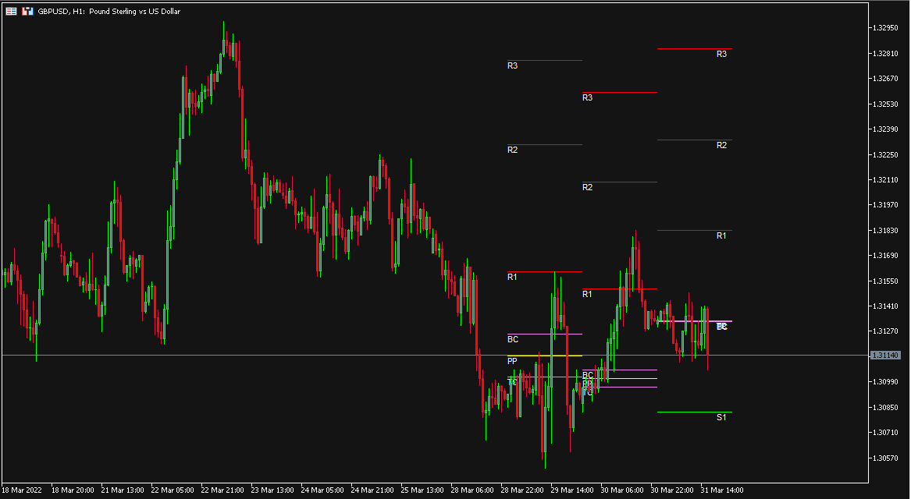

# CPR

> Source: https://fxcodebase.com/code/viewtopic.php?f=38&t=72029  
> Forum: 38 · Topic 72029 · 3 post(s)

---

## CPR

**Apprentice** · Fri Apr 01, 2022 2:21 am

Based on the request.
[https://fxcodebase.com/code/viewtopic.php?f=27&p=144699](https://fxcodebase.com/code/viewtopic.php?f=27&p=144699)

 [CPR.mq4](files/145507/CPR.mq4)

 [CPR.mq5](files/145507/CPR.mq5)

---

## Re: CPR

**logicgate** · Mon Apr 24, 2023 8:34 am

Hello dear Friend Apprentice, I have a request to mod the CPR indicator with the addition of the Fibonacci mode.

I am attaching the Fibo Pivots code here so you can have a look.

Basically what I wanted was for you to merge this fibo pivot code into the existing CPR. You could make two versions so I can check what looks "better".

In one version you would be essentially making this a 2 in 1 indicator.

In the other version you would be making the CPR indicator also project fib levels but based on the CPR pivot formula, not the pivot formula contained inside the fibo pivots indicator. (so you take a look at the code to see how the fib levels are projected, and then apply that logic to the current CPR indicator too).

Then we would have these extra settings:

Show Fibo Pivots? Yes/No
Levels: (so we can custom fib levels)
Upper Fib Color
Upper Fib Line Style:
Lower Fib Color
Lower Fib Line Style:

Basically you are making available the same options inside the fibo pivots indicator, but of course we don't need the timeframe selection as it will share the same timeframe selection already available in CPR indicator.

Also, you can hard code the main pivot line of the fibo pivots formula to be invisible (hardcode color to NONE) as I am only interested in the projected fib levels. (and we already have the CPR main pivots so, no need for fibo main pivot line).

Best regards!

---

## Re: CPR

**Apprentice** · Wed Apr 26, 2023 1:24 pm

We have added your request to the development list.
Development reference 367.
