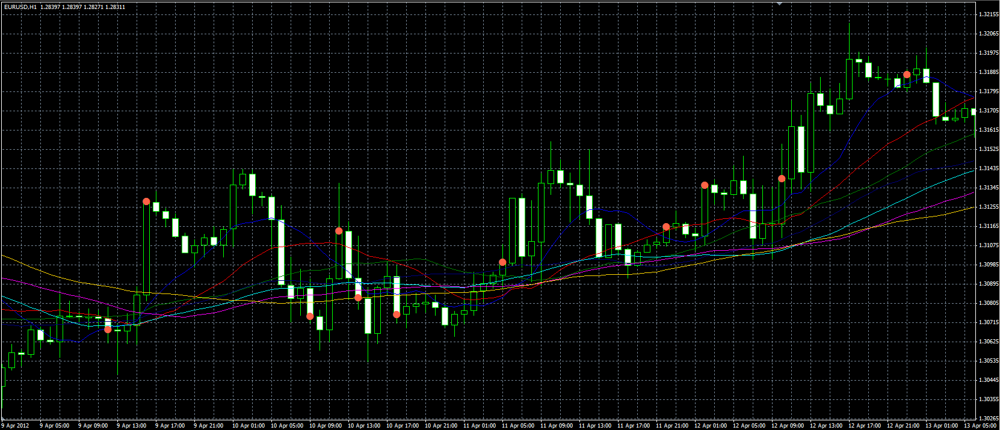

# Cross MA indicator

> Source: https://fxcodebase.com/code/viewtopic.php?f=38&t=18293  
> Forum: 38 · Topic 18293 · 4 post(s)

---

## Cross MA indicator

**Alexander.Gettinger** · Mon May 14, 2012 9:10 am

The indicator draws a set of averages ([viewtopic.php?f=38&t=17984](https://fxcodebase.com/code/viewtopic.php?f=38&t=17984)) and indicates if the price is on one side of all of MA.

 

Download:

 [Cross_MA.mq4](files/32958/Cross_MA.mq4)

---

## Re: Cross MA indicator

**adloule** · Sun May 03, 2015 6:38 am

is it possible to have this indi. in .lua
thank you

---

## Re: Cross MA indicator

**Apprentice** · Mon May 04, 2015 7:55 am

Requested can be found here.
[viewtopic.php?f=17&t=9568&p=32546&hilit=Set+of+averages#p20513](https://fxcodebase.com/code/viewtopic.php?f=17&t=9568&p=32546&hilit=Set+of+averages#p20513)

---

## Re: Cross MA indicator

**adloule** · Mon May 04, 2015 10:13 am

thank you Sir
