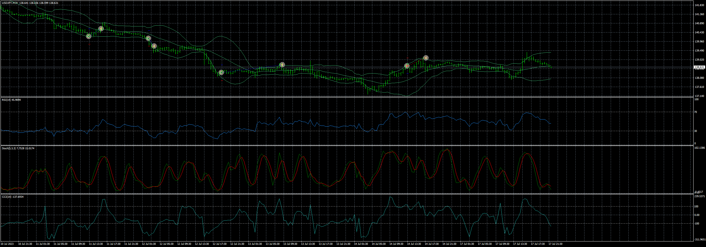

# CRSB_EA_v1.00

> Source: https://fxcodebase.com/code/viewtopic.php?f=38&t=73937  
> Forum: 38 · Topic 73937 · 4 post(s)

---

## CRSB_EA_v1.00

**Apprentice** · Mon Jul 17, 2023 2:10 pm

Based on the request.
[https://fxcodebase.com/code/viewtopic.php?f=27&p=151608](https://fxcodebase.com/code/viewtopic.php?f=27&p=151608)

 [CRSB_EA_v1.00.mq4](files/151659/CRSB_EA_v1.00.mq4)

---

## Re: CRSB_EA_v1.00

**puneet1979** · Fri Oct 20, 2023 3:15 pm

Hi,

I am getting the error

<<2023.10.20 22:12:13.286	2023.06.08 01:00:00 CRSB_EA_v1.00 NAS100,H1: zero divide in 'CRSB_EA_v1.00.mq4' (847,43)>>

Line 847 is double maxlotMargin = (AccountEquity()/marginReq) * 0.95;

Please help

---

## Re: CRSB_EA_v1.00

**Apprentice** · Sat Oct 21, 2023 9:03 am

We have added your request to the development list.
Development reference 941

---

## Re: CRSB_EA_v1.00

**Apprentice** · Mon Jul 08, 2024 2:08 pm

[CRSB_EA_v1.10.mq4](files/156059/CRSB_EA_v1.10.mq4)

Try this version.
