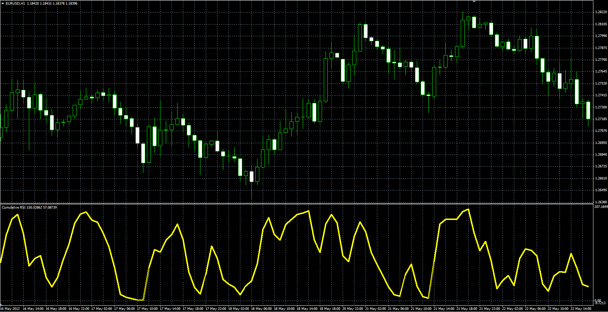

# Cumulative RSI

> Source: https://fxcodebase.com/code/viewtopic.php?f=38&t=61694  
> Forum: 38 · Topic 61694 · 3 post(s)

---

## Cumulative RSI

**Alexander.Gettinger** · Fri Jan 09, 2015 4:16 pm

Original LUA oscillator: [viewtopic.php?f=17&t=1340](https://fxcodebase.com/code/viewtopic.php?f=17&t=1340).

> The cumulative RSI is intended to be used in cumulative RSI strategy described in Chapter 9 of Trading Strategies That Work by Larry Connors and Cesar Alvarez.
>
> The formula is pretty simple:
> CumulativeRSI = SUM(RSI(N), X)
>
> The book recommends to use the small numbers for N and X, such as 2.

 

Download:

 [Cumulative_RSI.mq4](files/98063/Cumulative_RSI.mq4)

---

## Re: Cumulative RSI

**balibakbar** · Thu Aug 06, 2015 6:17 pm

This doesn't seem to be Connor's RSI..

Connor's RSI consists of three components:
a. Short term Relative Strength, i.e., RSI(3).
b. Counting consecutive up and down days (streaks) and "normalizing" the data using RSI(streak,2). The result is a bounded, 0-100 indicator.
c. Magnitude of the move (percentage-wise) in relation to previous moves. This is measured using the percentRank() function.

The formula given is:
ConnorsRSI(3,2,100) = [ RSI(Close,3) + RSI(Streak,2) + PercentRank(percentMove,100) ] / 3

Is it possible to code this in Lua?

---

## Re: Cumulative RSI

**Apprentice** · Tue Aug 11, 2015 3:41 am

Try this version.
[viewtopic.php?f=17&t=62518](https://fxcodebase.com/code/viewtopic.php?f=17&t=62518)
