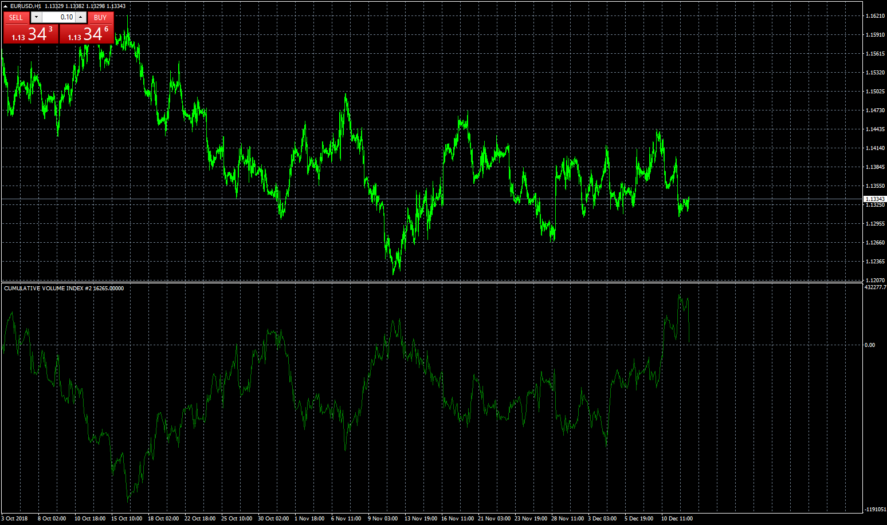
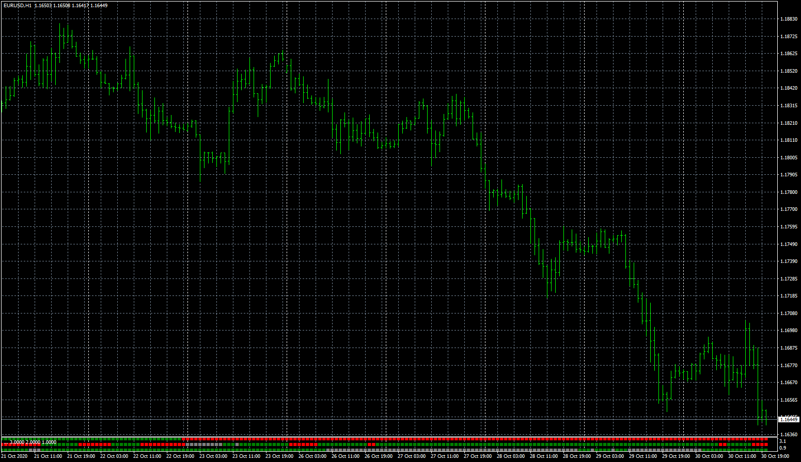
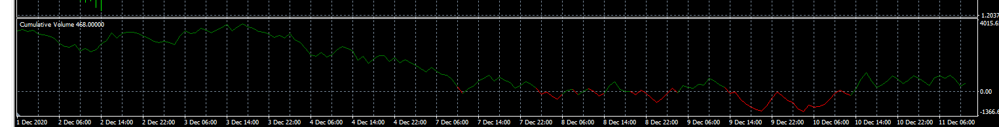
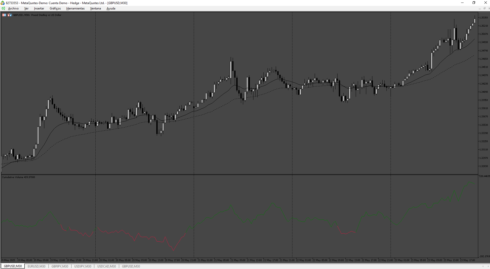

# CUMULATIVE VOLUME INDEX

> Source: https://fxcodebase.com/code/viewtopic.php?f=38&t=67145  
> Forum: 38 · Topic 67145 · 47 post(s)

---

## CUMULATIVE VOLUME INDEX

**Apprentice** · Wed Dec 12, 2018 7:51 am

 [CVI_2.mq4](files/122720/CVI_2.mq4)

TS2/Lua Version.
[viewtopic.php?f=17&t=32247&p=54969#p54969](https://fxcodebase.com/code/viewtopic.php?f=17&t=32247&p=54969#p54969)

 [Cumulative_Volume avg.mq4](files/122720/Cumulative_Volume%20avg.mq4)

---

## Re: CUMULATIVE VOLUME INDEX

**logicgate** · Tue Aug 27, 2019 2:37 pm

Hi there my friend. Can you make a version which plots USD inverted? Thanks

---

## Re: CUMULATIVE VOLUME INDEX

**Apprentice** · Wed Aug 28, 2019 11:15 am

Inverted CVI or Inverted USD?

---

## Re: CUMULATIVE VOLUME INDEX

**logicgate** · Wed Aug 28, 2019 1:17 pm

> **Apprentice wrote:**
> Inverted CVI or Inverted USD?

Inverted USD

---

## Re: CUMULATIVE VOLUME INDEX

**Apprentice** · Thu Aug 29, 2019 6:31 am

Try this version.
[viewtopic.php?f=38&t=63846](https://fxcodebase.com/code/viewtopic.php?f=38&t=63846)

---

## Re: CUMULATIVE VOLUME INDEX

**logicgate** · Thu Aug 29, 2019 8:26 am

No my friend, you didn´t understand.

I want inverted USD inside the CVI. On the CVI you can type the currency right? So, when you choose USD in CVI, I wanted it to be inverted. Only the USD, the rest can remain as is.

---

## Re: CUMULATIVE VOLUME INDEX

**Apprentice** · Thu Aug 29, 2019 10:00 am

[CVI_3.mq4](files/128294/CVI_3.mq4)

Invert option added.

---

## Re: CUMULATIVE VOLUME INDEX

**logicgate** · Thu Aug 29, 2019 10:12 am

Thanks buddy!

---

## Re: CUMULATIVE VOLUME INDEX

**logicgate** · Thu Aug 29, 2019 11:04 am

Way easier to spot divergences now in the USD pairs with the inverted option:

---

## Re: CUMULATIVE VOLUME INDEX

**logicgate** · Wed Oct 02, 2019 8:13 am

> **Apprentice wrote:**
>
>
> The attachment **CVI_3.mq4** is no longer available
>
>
> Invert option added.

Dear friend can you rewrite CVI_3 indicator using the formula from the cumulative volume 1.2 (which is a delta (up volume minus down volume)? Attached here.

---

## Re: CUMULATIVE VOLUME INDEX

**Apprentice** · Thu Oct 03, 2019 4:50 am

Your request is added to the development list.
Development reference 156.

---

## Re: CUMULATIVE VOLUME INDEX

**Apprentice** · Wed Oct 09, 2019 11:15 am

I don't understand the logic required. It already calculates that delta.
Can you provide a bit more info for our development team?

---

## Re: CUMULATIVE VOLUME INDEX

**logicgate** · Wed Oct 09, 2019 4:47 pm

> **Apprentice wrote:**
> I don't understand the logic required. It already calculates that delta.
> Can you provide a bit more info for our development team?

Oh it already uses that same formula? Great. I checked the code so I could change the SMA to EMA (I did that in the cumulative volume 1.2 and it is giving me better results, can you make a version of the cumulative volume index using EMA?) Also, you could add the same input parameters that are missing:

The length
The timeframe to display

Thanks

---

## Re: CUMULATIVE VOLUME INDEX

**Apprentice** · Thu Oct 10, 2019 12:26 pm

Your request is added to the development list.
Development reference 1322.

---

## Re: CUMULATIVE VOLUME INDEX

**Apprentice** · Thu May 21, 2020 8:53 am

[Cumulative_Volume.mq4](files/134149/Cumulative_Volume.mq4)

Try this version.

---

## Re: CUMULATIVE VOLUME INDEX

**logicgate** · Wed Jul 22, 2020 4:32 pm

> **Apprentice wrote:**
>
>
> The attachment **Cumulative_Volume.mq4** is no longer available
>
>
> Try this version.

Hi there buddy, this one is missing the "currency" and "invert" options in indi settings.

So the request is:

Add currency and invert options to this last version.

Add option to choose SMA or EMA to plot the data.

Add "Bars Limit" option to choose size of history to be plotted.

Is it possible to make it calculate and sum the delta of 28 pairs?

For example, if I choose USD currency, the indi would be grabbing the "USD side" delta info of all pairs available in the market watch tab for example. (and it will do the same thing for each currency you choose)

And instead of plotting only one line, It would be better if it displayed two lines (so we would choose each line on the indi settings "currency 1" and "currency 2")

If we load the indicator on EURUSD chart, and set the currencies to USD and EUR, it would plot the sum of delta of all USD and EUR pairs available in the market watch.

Of course you need to download historical data for all of them in order to work.

I have attached a couple of images, one with how the settings would look like, and the other with the 28 pairs to be used in the calculation.

---

## Re: CUMULATIVE VOLUME INDEX

**Apprentice** · Thu Jul 23, 2020 9:15 am

Your request is added to the development list.
Development reference 1756.

---

## Re: CUMULATIVE VOLUME INDEX

**logicgate** · Thu Jul 23, 2020 12:38 pm

> **Apprentice wrote:**
> Your request is added to the development list.
> Development reference 1756.

Thanks buddy, look I forgot to add the very important option of "reset time" in the request, so please. Very important. If reset time left blank indicator just keeps plotting continuously, if a time is set there, then when it reaches it, data starts being plotted from the zero line in the indicator.

---

## Re: CUMULATIVE VOLUME INDEX

**Apprentice** · Fri Jul 24, 2020 7:57 am

[Cumulative_Volume Currency.mq4](files/136265/Cumulative_Volume%20Currency.mq4)

 [Cumulative_Volume MS MTF.mq4](files/136265/Cumulative_Volume%20MS%20MTF.mq4)

 [Cumulative_Volume.mq4](files/136265/Cumulative_Volume.mq4)

Try these versions.

---

## Re: CUMULATIVE VOLUME INDEX

**logicgate** · Fri Jul 24, 2020 9:18 am

So I just gave it a test, not exactly what I requested, let´s see:

-Missing the reset time input to make delta start from zero at desired time.

-Cumulative Volume "MS", what is that? Only different option in there is "symbol", does it just plot the cumulative volume of another symbol in a different symbol? Anyways, an interesting extra but not what I wanted. Perhaps other people might find useful.

-Cumulative Volume Currency - Ok, what it is exactly doing? It was supposed to use in the calculation only the 28 pairs of the list in the screenshot I posted in the request. I looked at the code and it is including a bunch of exotic stuff, basically all symbols available in the broker. Please use the 28 pairs of the list provided. Also, to me it seems it is just adding up the values of all symbols together. What it was supposed to do was to separate the currencies, similar to what those currency strength meters do you know? How to they come up with a strength value for USD only, for example? I wanted that same logic used to calculate the delta each currency, separately. So if I choose in indi settings to plot USD only, it would plot the delta of USD, of all USD pairs combined.

---

## Re: CUMULATIVE VOLUME INDEX

**Apprentice** · Sun Jul 26, 2020 3:47 pm

Your request is added to the development list.
Development reference 1769.

---

## Re: CUMULATIVE VOLUME INDEX

**Kinslay** · Tue Oct 27, 2020 2:23 pm

Hi Apprentice,

can you program this indicator with the following settings?

Cumulative Volume > 0 = green line
Cumulative Volume < 0 = red line

Thank you

> **Apprentice wrote:**
>
>
> Cumulative_Volume Currency.mq4
>
>
>
>
> Cumulative_Volume MS MTF.mq4
>
>
>
>
> Cumulative_Volume.mq4
>
>
>
> Try these versions.

---

## Re: CUMULATIVE VOLUME INDEX

**Apprentice** · Wed Oct 28, 2020 12:07 pm

Your request is added to the development list.
Development reference 2233.

---

## Re: CUMULATIVE VOLUME INDEX

**Apprentice** · Thu Oct 29, 2020 11:53 am

[Cumulative_Volume.mq4](files/138557/Cumulative_Volume.mq4)

Try this version.

---

## Re: CUMULATIVE VOLUME INDEX

**Kinslay** · Tue Nov 03, 2020 10:52 am

Hi Apprentice,

thanks, the indicator is working properly.
I need another request.
Is it possible to create a heatmap?

The goal is to see the indicator color on different timeframes but on a single screen.

The timeframes that interest me are the following, m5, m15, h1, h4, daily.

Kind regards

> **Apprentice wrote:**
>
>
> Cumulative_Volume.mq4
>
>
> Try this version.

---

## Re: CUMULATIVE VOLUME INDEX

**Apprentice** · Wed Nov 04, 2020 3:44 am

Your request is added to the development list.
Development reference 2251.

---

## Re: CUMULATIVE VOLUME INDEX

**Apprentice** · Wed Nov 04, 2020 8:56 am

[Cumulative_Volume_dashboard.mq4](files/138645/Cumulative_Volume_dashboard.mq4)

Try this version.

---

## Re: CUMULATIVE VOLUME INDEX

**Kinslay** · Wed Nov 04, 2020 12:20 pm

Hi Apprentice,

Thanks for the work you have done, unfortunately, however, when I insert dax, sp500 etc .. the platform freezes.

Also, I would like the indicator to work like a map, below I am attaching the image I would like to see.

> **Apprentice wrote:**
>
>
> The attachment **Cumulative_Volume_dashboard.mq4** is no longer available
>
>
> Try this version.

---

## Re: CUMULATIVE VOLUME INDEX

**Apprentice** · Thu Nov 05, 2020 3:41 am

Your request is added to the development list.
Development reference 2256.

---

## Re: CUMULATIVE VOLUME INDEX

**Apprentice** · Fri Nov 06, 2020 3:43 am

 [Cumulative_Volume_heatmap.mq4](files/138705/Cumulative_Volume_heatmap.mq4)

There is nothing we can do with 1)

You will need to install Cumulative_Volume.MQ4

---

## Re: CUMULATIVE VOLUME INDEX

**Kinslay** · Fri Nov 06, 2020 4:27 am

Hi Apprentice,

Thanks for your work but when i go to change timeframe on indicator, this don't run.
It only works with if I don't change anything.

Can you fix this bug?

Thankyou

> **Apprentice wrote:**
> Try this version.
>
>
> Cumulative_Volume_heatmap.mq4
>
>
> There is nothing we can do with 1)

---

## Re: CUMULATIVE VOLUME INDEX

**Apprentice** · Sat Nov 07, 2020 6:35 am

Your request is added to the development list.
Development reference 2268.

---

## Re: CUMULATIVE VOLUME INDEX

**Apprentice** · Sun Nov 08, 2020 11:04 am

Try it now.

---

## Re: CUMULATIVE VOLUME INDEX

**alienfriend18** · Fri Dec 04, 2020 1:02 pm

Need average cummulative index of multiple symbols with multitimeframe option

Example
Cummulative volume index of symbol-A
 '' Symbol-B'
 Symbol-C'

Final cummulative volume index line is the average of the input symbols

---

## Re: CUMULATIVE VOLUME INDEX

**Apprentice** · Fri Dec 04, 2020 1:30 pm

Your request is added to the development list.
Development reference 2400.

---

## Re: CUMULATIVE VOLUME INDEX

**Apprentice** · Tue Dec 08, 2020 9:03 am

Try this version.
[viewtopic.php?f=38&t=67145](https://fxcodebase.com/code/viewtopic.php?f=38&t=67145)

---

## Re: CUMULATIVE VOLUME INDEX

**alienfriend18** · Tue Dec 08, 2020 12:29 pm

> **Apprentice wrote:**
> Try this version.
> [viewtopic.php?f=38&t=67145](https://fxcodebase.com/code/viewtopic.php?f=38&t=67145)

cumulative volume index avg indicator not working

---

## Re: CUMULATIVE VOLUME INDEX

**Apprentice** · Tue Dec 08, 2020 3:08 pm

Make sure to have Cumulative_Volume v1.3 installed.

---

## Re: CUMULATIVE VOLUME INDEX

**alienfriend18** · Tue Dec 08, 2020 11:35 pm

> **Apprentice wrote:**
> Make sure to have Cumulative_Volume v1.3 installed.

Sorry sir not working for me...1.3 already installed

---

## Re: CUMULATIVE VOLUME INDEX

**Apprentice** · Thu Dec 10, 2020 5:43 am

Your request is added to the development list.
Development reference 2437.

---

## Re: CUMULATIVE VOLUME INDEX

**Apprentice** · Fri Dec 11, 2020 5:04 am

 [Cumulative_Volume avg.mq4](files/139474/Cumulative_Volume%20avg.mq4)

---

## Re: CUMULATIVE VOLUME INDEX

**alienfriend18** · Tue Dec 22, 2020 9:39 am

Sorry sir not working perfectly........indicator not taking other signal volume...only taking current chart symbol volume

---

## Re: CUMULATIVE VOLUME INDEX

**Apprentice** · Wed Dec 23, 2020 3:18 am

Your request is added to the development list.
Development reference 2520.

---

## Re: CUMULATIVE VOLUME INDEX

**Apprentice** · Fri Dec 25, 2020 5:24 am

I don't have any issues. Make sure you have subscribed for the selected symbols and do have history loaded

---

## Re: CUMULATIVE VOLUME INDEX

**logicgate** · Fri Nov 22, 2024 5:25 am

It would be great if we could get this for MT5 as well, thanks buddy

---

## Re: CUMULATIVE VOLUME INDEX

**Apprentice** · Fri Nov 22, 2024 12:57 pm

We have added your request to the development list.
Development reference 852

---

## Re: CUMULATIVE VOLUME INDEX

**Apprentice** · Sat May 24, 2025 2:16 pm

 [cumulative_vol_index.mq5](files/159350/cumulative_vol_index.mq5)
