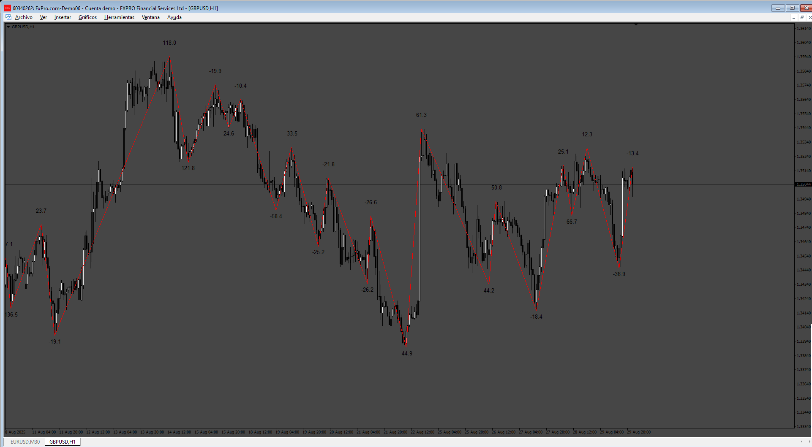
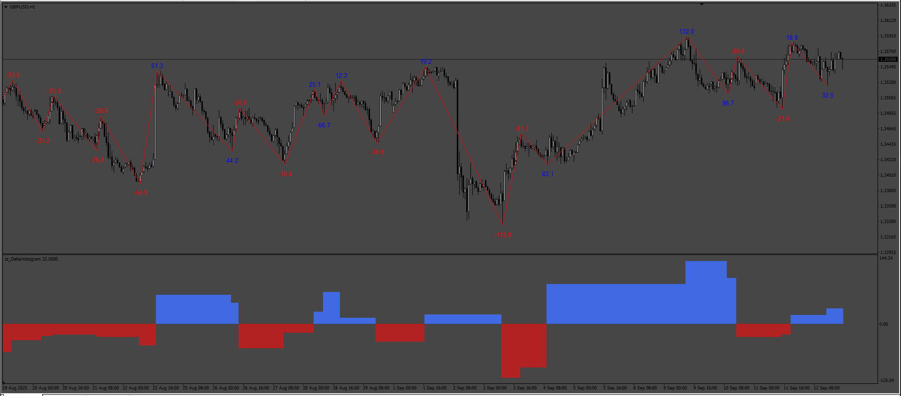

# Cumulative Volume

> Source: https://fxcodebase.com/code/viewtopic.php?f=38&t=76289  
> Forum: 38 · Topic 76289 · 6 post(s)

---

## Cumulative Volume

**Apprentice** · Tue Sep 02, 2025 3:57 am

 [ZZ_Delta.mq4](files/160441/ZZ_Delta.mq4)

---

## Re: Cumulative Volume

**iardavan** · Sun Sep 07, 2025 5:36 pm

Greetings and respects,
Thank you for your kindness, and if possible, please consider incorporating the following features.

I’ve been testing the indicator since its release, and it’s excellent.
However, the indicator could use some improvements, and everything looks great so far. It would be a shame if it lacked these features.
I greatly appreciate your generosity in advance:

*An option, as shown in the image, to determine if the delta at three high points or three low points has changed, allowing comparison between them and utilizing the existing code for Delta Rising or Delta Falling.

*The ability to choose and change the colors for positive and negative deltas.

*Adjusting the spacing of labels so they don’t overlap with candles and can be moved above or below them.

*Additionally, creating a separate indicator for a histogram based on the structure and formulas of the ZigZag Delta, as shown in the image.

*In the ZigZag Delta indicator, based on price and delta, include an option to enable or disable showing divergence for the delta.

Lastly, I’d like to add that I converted your indicator to MT5 with a lot of effort and challenges. I’m not sure if it’s possible to provide versions for both platforms.
Many thanks!

---

## Re: Cumulative Volume

**Apprentice** · Mon Sep 08, 2025 5:58 am

We have added your request to the development list.
Development reference 571

---

## Re: Cumulative Volume

**iardavan** · Tue Sep 16, 2025 9:13 am

Hello and greetings to you. I’ve been checking my email and the forum day and night for this indicator. I just noticed that one of the photos wasn’t uploaded, which I’ve attached. Thank you!

*An option, as shown in the image, to determine if the delta at three high points or three low points has changed, allowing comparison between them and utilizing the existing code for Delta Rising or Delta Falling.

---

## Re: Cumulative Volume

**Apprentice** · Tue Sep 23, 2025 3:41 am

 [ZZ_Delta_v2.mq4](files/160598/ZZ_Delta_v2.mq4)

 [zz_DeltaHistogram.mq4](files/160598/zz_DeltaHistogram.mq4)

---

## Re: Cumulative Volume

**iardavan** · Wed Sep 24, 2025 1:42 pm

Many thanks and appreciation for your efforts. Do you have any opinions on how to derive divergence on these indicators for delta, both technically and practically? Please guide me, I’d appreciate it.
