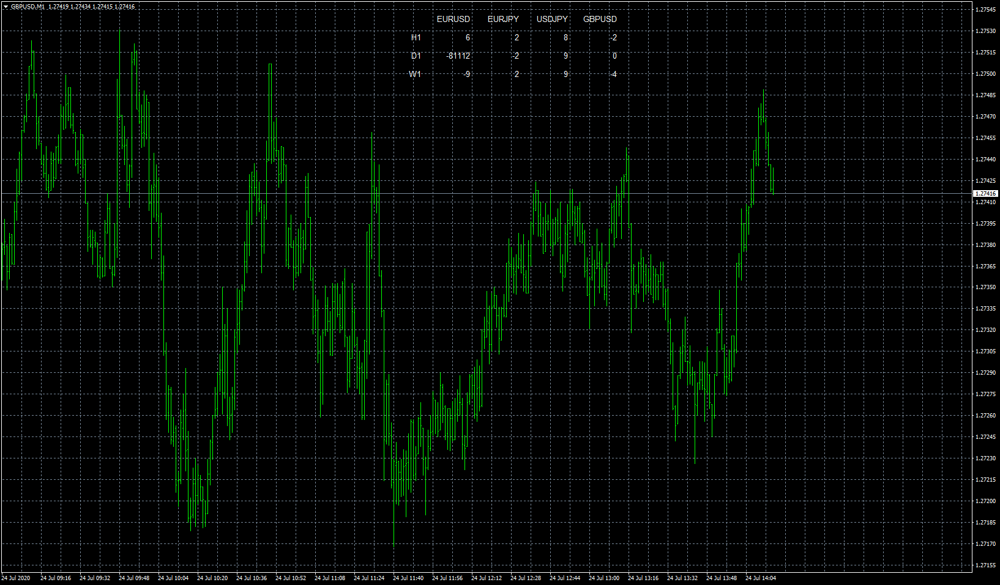

# CumulativeDelta Dashboard

> Source: https://fxcodebase.com/code/viewtopic.php?f=38&t=70220  
> Forum: 38 · Topic 70220 · 5 post(s)

---

## CumulativeDelta Dashboard

**Apprentice** · Fri Jul 24, 2020 8:00 am

Based on request.
[viewtopic.php?f=27&t=70215](https://fxcodebase.com/code/viewtopic.php?f=27&t=70215)

 [CumulativeDelta 2.mq4](files/136266/CumulativeDelta%202.mq4)

 [CumulativeDelta Dashboard.mq4](files/136266/CumulativeDelta%20Dashboard.mq4)

---

## Re: CumulativeDelta Dashboard

**Apprentice** · Fri Sep 18, 2020 7:56 am

[CumulativeDelta 2.mq4](files/137723/CumulativeDelta%202.mq4)

 [CumulativeDelta Dashboard.mq4](files/137723/CumulativeDelta%20Dashboard.mq4)

---

## Re: CumulativeDelta Dashboard

**logicgate** · Fri Nov 22, 2024 5:21 am

Can we have the latest version converted to MT5, please?

---

## Re: CumulativeDelta Dashboard

**Apprentice** · Fri Nov 22, 2024 12:57 pm

We have added your request to the development list.
Development reference 853

---

## Re: CumulativeDelta Dashboard

**Apprentice** · Mon May 26, 2025 1:52 pm

[CumulativeDelta.mq5](files/159383/CumulativeDelta.mq5)

 [CumulativeDelta_Dashboard.mq5](files/159383/CumulativeDelta_Dashboard.mq5)
