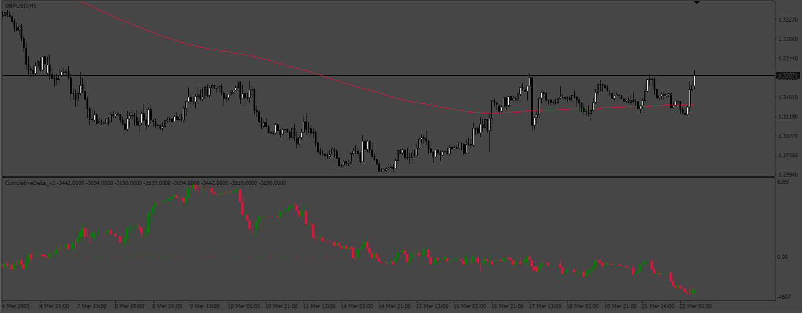

# CumulativeDelta_v2

> Source: https://fxcodebase.com/code/viewtopic.php?f=38&t=74702  
> Forum: 38 · Topic 74702 · 4 post(s)

---

## CumulativeDelta_v2

**Apprentice** · Sat Mar 16, 2024 2:33 pm

Based on the request.
[https://fxcodebase.com/code/viewtopic.php?f=27&p=154588](https://fxcodebase.com/code/viewtopic.php?f=27&p=154588)
The indicator can’t show the info in the beginning.
You just put on the chart and wait for the indicator to start to draw candles

 [CumulativeDelta_v2.mq4](files/154714/CumulativeDelta_v2.mq4)

 [CumulativeDelta_v2.mq5](files/154714/CumulativeDelta_v2.mq5)

---

## Re: CumulativeDelta_v2

**theCuchuoi** · Wed May 29, 2024 6:18 am

Sir, could you please convert this indicator to MQL5?

---

## Re: CumulativeDelta_v2

**Apprentice** · Sun Jun 02, 2024 2:39 pm

We have added your request to the development list.
Development reference 459

---

## Re: CumulativeDelta_v2

**Apprentice** · Wed Oct 01, 2025 5:19 am

MT5 version added.
