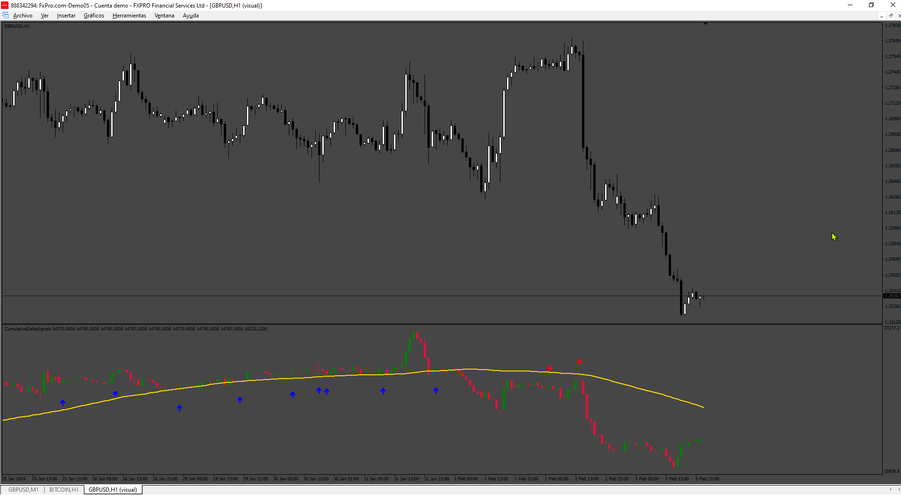

# CumulativeDeltaSignals

> Source: https://fxcodebase.com/code/viewtopic.php?f=38&t=74969  
> Forum: 38 · Topic 74969 · 6 post(s)

---

## CumulativeDeltaSignals

**Apprentice** · Wed Jun 12, 2024 2:15 pm

Based on the request.
[https://fxcodebase.com/code/viewtopic.php?f=38&t=74945](https://fxcodebase.com/code/viewtopic.php?f=38&t=74945)

 [CumulativeDeltaSignals.mq4](files/155731/CumulativeDeltaSignals.mq4)

---

## Re: CumulativeDeltaSignals

**t_axe123** · Sat Jun 15, 2024 4:36 am

I don't know for other, but for me isn't working. I see only white/black screen of the indicator (depending on the MT4 theme). Also, in the "experts" or "journal" tabs from Terminal, I see that the indicator has been loaded properly without any errors. Is that something else that should we do?
Thanks!

---

## Re: CumulativeDeltaSignals

**Apprentice** · Sun Jun 16, 2024 9:38 am

We have added your request to the development list.
Development reference 501

---

## Re: CumulativeDeltaSignals

**Apprentice** · Wed Jun 19, 2024 5:02 pm

I checked the indicator, and it saves the tick data in the "Tick_EURUSD.csv" file for drawing (in the case of the EURUSD chart). If there is no initial data, it cannot draw anything. When switched to the M1 timeframe, the forming candles become visible quickly.

---

## Re: CumulativeDeltaSignals

**trtrader** · Thu Jun 20, 2024 7:58 am

same for me. just white screen

---

## Re: CumulativeDeltaSignals

**Apprentice** · Tue Jun 25, 2024 11:50 am

You need to wait a bit for the candles to appear; they are visible the earliest on the M1 timeframe.

I just noticed that there is no error message if the DLL usage is not enabled. I have included this in the code and attached it as v2.

You need to enable DLL usage both in the indicator settings window and in the MetaTrader options.
