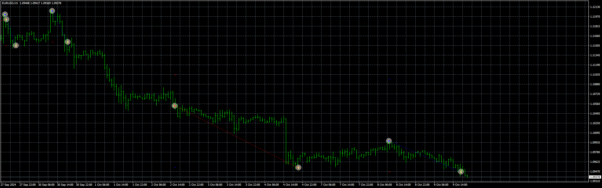

# Cus_UT_Bot_EA

> Source: https://fxcodebase.com/code/viewtopic.php?f=38&t=75238  
> Forum: 38 · Topic 75238 · 4 post(s)

---

## Cus_UT_Bot_EA

**Apprentice** · Fri Sep 27, 2024 6:43 am

Based on the request.
[https://fxcodebase.com/code/viewtopic.p ... 77#p150577](https://fxcodebase.com/code/viewtopic.php?f=27&p=150577#p150577)

 [Cus_2_UT_Bot_with_STC.mq4](files/156810/Cus_2_UT_Bot_with_STC.mq4)

 [Cus_UT_Bot_EA.mq4](files/156810/Cus_UT_Bot_EA.mq4)

 [Signaler.mqh](files/156810/Signaler.mqh)

---

## Re: Cus_UT_Bot_EA

**trtrader** · Fri Sep 27, 2024 9:36 am

not able to add it to chart . did everything as usual

2024.09.27 10:34:39.031	2024.06.03 00:00:00 cannot open file 'C:\Program Files (x86)\MetaTrader 4\MQL4\indicators\Cus_2_UT_Bot_with_STC.ex4' [2]

2024.09.27 10:34:39.031	2024.06.03 00:00:00 Cus_UT_Bot_EA USDJPY,H1: Alert: THIS EA NEED AN INDICATOR, install the file: Cus_2_UT_Bot_with_STC into the folder: MQL4/Indicators.

---

## Re: Cus_UT_Bot_EA

**Apprentice** · Tue Oct 01, 2024 5:41 am

We have added your request to the development list.
Development reference 751

---

## Re: Cus_UT_Bot_EA

**Apprentice** · Wed Oct 09, 2024 12:17 pm

Cus_2_UT_Bot_with_STC fixed.
