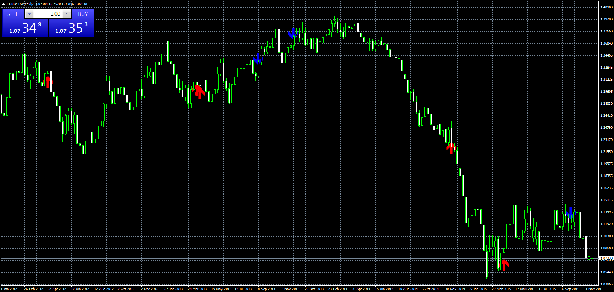

# Custom Arrows

> Source: https://fxcodebase.com/code/viewtopic.php?f=38&t=62890  
> Forum: 38 · Topic 62890 · 3 post(s)

---

## Custom Arrows

**Apprentice** · Mon Nov 16, 2015 6:52 am

Based on request.
[viewtopic.php?f=27&t=62882](https://fxcodebase.com/code/viewtopic.php?f=27&t=62882)

UP ARROW)
High(7) < High(9)
Low(3) < Low(4)
Close(6) < Close(1)
Close(1) < Open(0);

DOWN ARROW
High(7) > High(9)
Low(3) > Low(4)
Close(6) >Close(1)
Close(1) > Open(0);

 [Custom Arrows.mq4](files/103390/Custom%20Arrows.mq4)

---

## Re: Custom Arrows

**TroyForeverAfter** · Sun Dec 20, 2015 6:46 am

Hello, does the arrow appear at the beginning of the candle

---

## Re: Custom Arrows

**Apprentice** · Mon Dec 21, 2015 6:02 am

Can you explain phrase "beginning of the candle"
