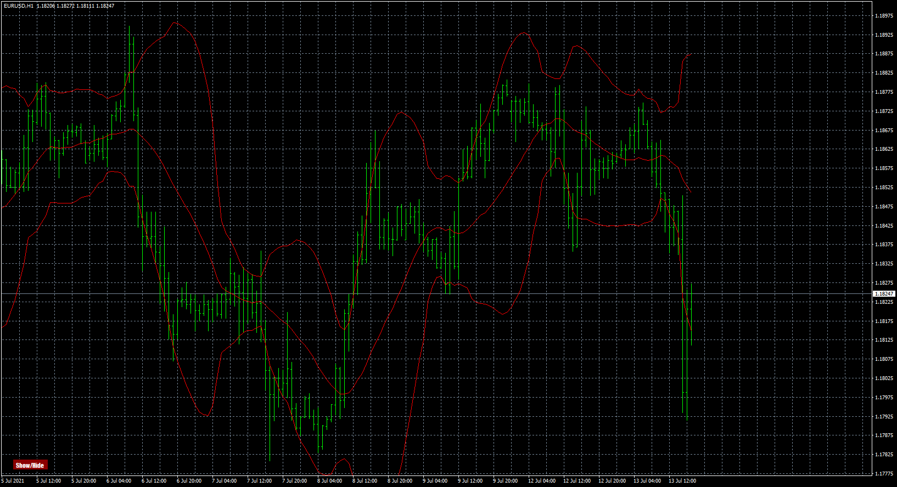

# custom_bands

> Source: https://fxcodebase.com/code/viewtopic.php?f=38&t=71412  
> Forum: 38 · Topic 71412 · 5 post(s)

---

## custom_bands

**Apprentice** · Tue Aug 10, 2021 9:36 am

Based on the request.
[https://fxcodebase.com/code/viewtopic.php?f=38&t=71401](https://fxcodebase.com/code/viewtopic.php?f=38&t=71401)

 [custom_bands.mq4](files/143173/custom_bands.mq4)

---

## Re: custom_bands

**pipibrasci** · Tue Aug 10, 2021 5:02 pm

> **Apprentice wrote:**
>
>
> eurusd-h1-fxcm-australia-pty-2.png
>
>
> Based on the request.
> [https://fxcodebase.com/code/viewtopic.php?f=38&t=71401](https://fxcodebase.com/code/viewtopic.php?f=38&t=71401)
>
>
> custom_bands.mq4

App and Team,

Great work. Button doesnt seem to work. Maybe a little error. Thanks.

---

## Re: custom_bands

**Apprentice** · Wed Aug 11, 2021 11:38 am

Your request is added to the development list.
Development reference 736.

---

## Re: custom_bands

**Apprentice** · Wed Aug 18, 2021 1:31 pm

Fixed.

---

## Re: custom_bands

**pipibrasci** · Thu Aug 19, 2021 5:18 am

> **Apprentice wrote:**
> Fixed.

App and team

Great and many thanks!
