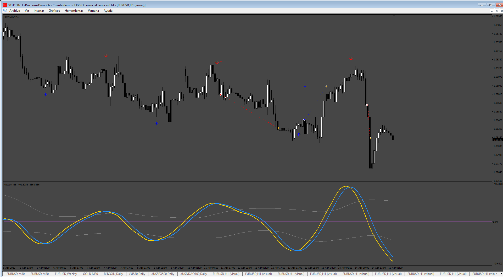
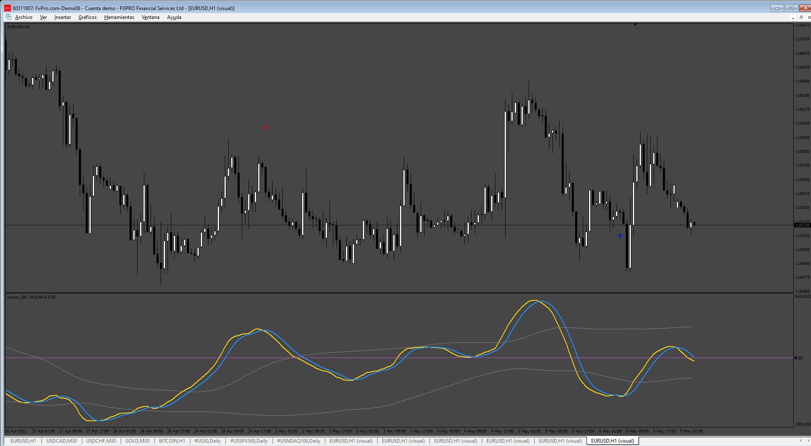

# Custom_BB_EA

> Source: https://fxcodebase.com/code/viewtopic.php?f=38&t=75764  
> Forum: 38 · Topic 75764 · 5 post(s)

---

## Custom_BB_EA

**Apprentice** · Fri Mar 28, 2025 4:25 am

Based on the request.
[https://fxcodebase.com/code/viewtopic.php?f=38&t=75743](https://fxcodebase.com/code/viewtopic.php?f=38&t=75743)

 [custom_BB.mq4](files/158802/custom_BB.mq4)

 [Custom_BB_EA.mq4](files/158802/Custom_BB_EA.mq4)

The indicator repaints constantly, so you need to look for signals from several candles back, like 10 candles. I added a variable for this. I also made changes to the indicator because it didn't have buffers for the arrows.

---

## Re: Custom_BB_EA

**KUSHI90** · Thu Apr 03, 2025 4:24 am

sir your awesome sir, but sir yes arrow it repaint,sir add
buffer on this indicator
? its ok sir many2 thanks sir making this EA

---

## Re: Custom_BB_EA

**KUSHI90** · Fri Apr 04, 2025 1:49 am

sir can you fix this arrow double view signal??

---

## Re: Custom_BB_EA

**Apprentice** · Tue Apr 08, 2025 3:02 am

We have added your request to the development list.
Development reference 256

---

## Re: Custom_BB_EA

**Apprentice** · Wed Apr 16, 2025 2:43 am

 [custom_BB.mq4](files/158966/custom_BB.mq4)
