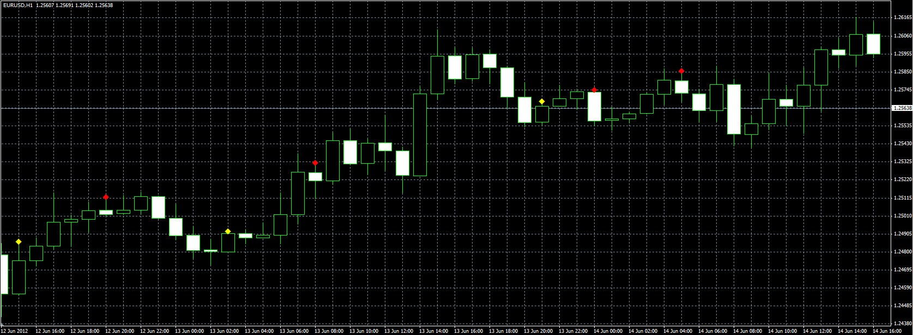
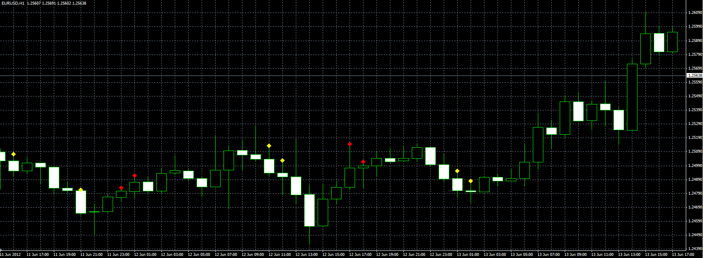

# Custom candle pattern

> Source: https://fxcodebase.com/code/viewtopic.php?f=38&t=20494  
> Forum: 38 · Topic 20494 · 8 post(s)

---

## Custom candle pattern

**Alexander.Gettinger** · Fri Jun 22, 2012 4:36 pm

The indicator provides the user to specify a custom format pattern candle and draws patterns on the chart.
U - UP candle (Close>Open),
D - DOWN candle (Close<Open),
N - Nothing (UP or DOWN).

For example, Pattern="UUUD":

 

Pattern="DNUUU":

 

Download:

 [Custom_Pattern.mq4](files/35921/Custom_Pattern.mq4)

---

## Re: Custom candle pattern

**Alexander.Gettinger** · Tue Jul 17, 2012 4:28 pm

Expert advisor based on this indicator: [viewtopic.php?f=38&t=21107](https://fxcodebase.com/code/viewtopic.php?f=38&t=21107)

---

## Re: Custom candle pattern

**swizzz** · Sat Sep 22, 2012 8:12 am

hi Alexander ,
good indicator.Can you add some parameters to make custom candle pattern like on attached pictures.its only examples

---

## Re: Custom candle pattern

**Apprentice** · Sun Sep 23, 2012 2:33 pm

Your request is added to the development list.

---

## Re: Custom candle pattern

**TygerKrane** · Thu Nov 08, 2012 10:52 am

This is freakin awesome, been looking for this for awhile!!

Could you add two features to this please?
At the close of the last candle in our pattern, could there be options to enable:
[*]Pop-up Alert (hopefully with an input field so that we can choose the soundfile as well)
[*]Email/Push Notification Alerts

If you could add on these two things that would be great!!

Thanks!
¥Krane¥

---

## Re: Custom candle pattern

**Apprentice** · Fri Nov 09, 2012 6:16 am

Your request is added to the development list.

---

## Re: Custom candle pattern

**TygerKrane** · Mon Nov 12, 2012 2:10 pm

> **Apprentice wrote:**
> Your request is added to the development list.

Hi Apprentice,
I got a chance to watch how this indicator works live, so I would like to modify my request. ( I think it might make my request easier as well.)

I noticed that the indicator makes a dot **before**the last candle of the pattern closes. I actually prefer this b/c it gives me a "heads up" before my pattern finishes (this way I can get ready on the charts before my pattern finishes, so that I can enter right at the beginning of the next candle.)

Anyways, I wanted to modify the request so that the Pop-up Alert/ Email/ Push Notification occurs **at the same time** that the dot pops up. (NOT at the close of the last candle in the pattern, like I requested earlier.)

Sorry to change my request, but now that I have seen how the indicator works live, it was necessary to modify what I originally asked for.

---

## Re: Custom candle pattern

**Alexander.Gettinger** · Tue Dec 18, 2018 7:04 pm

Please try this version of the indicator:

 [Custom_Pattern.mq4](files/122934/Custom_Pattern.mq4)
