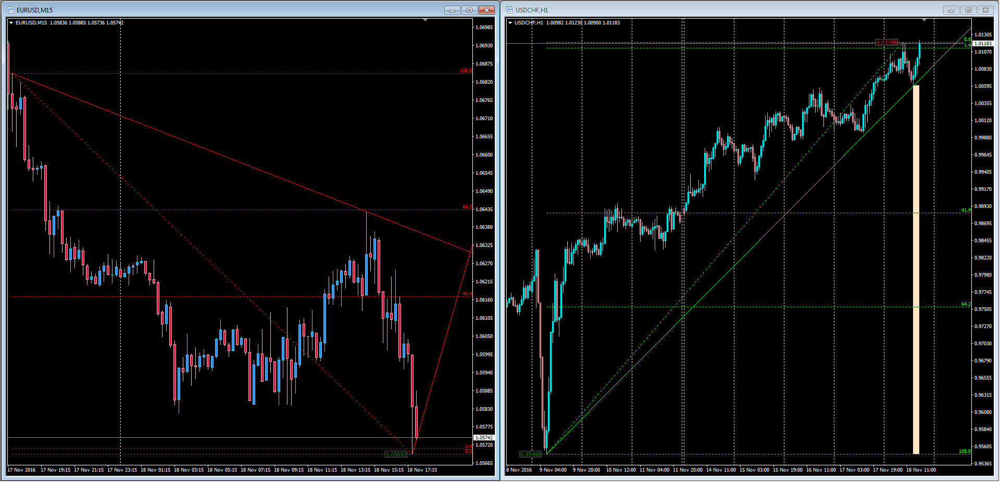

# Custom Fibo Levels

> Source: https://fxcodebase.com/code/viewtopic.php?f=38&t=64113  
> Forum: 38 · Topic 64113 · 5 post(s)

---

## Custom Fibo Levels

**Apprentice** · Fri Nov 18, 2016 12:23 pm

Description:
Modification made to a Fibonacci Indicator to add custom levels based on request.

 [CustomLevels.mq4](files/109134/CustomLevels.mq4)

---

## Re: Custom Fibo Levels

**Ehab.Ali** · Tue Nov 22, 2016 12:53 pm

working fine sir can the level contain the price

level description
example :
level = 0.414
description = (%$) 41.4

---

## Re: Custom Fibo Levels

**Apprentice** · Sat Nov 26, 2016 7:20 am

Your request is added to the development list, Under Id Number 3677
 If someone is interested to do this task, please contact me.

---

## Re: Custom Fibo Levels

**Apprentice** · Tue Dec 06, 2016 4:02 am

Quick update to add Price and Fibo Level % instead of only the Level.

---

## Re: Custom Fibo Levels

**Ehab.Ali** · Wed Dec 14, 2016 8:25 am

> **Apprentice wrote:**
> Quick update to add Price and Fibo Level % instead of only the Level.

THANK YOU ALOT MAN GREAT WORK
