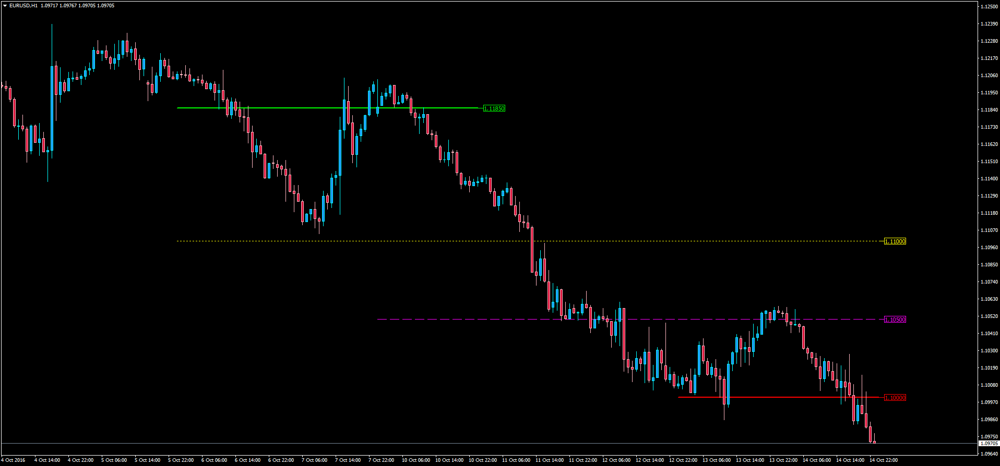

# Custom Horizontal Lines

> Source: https://fxcodebase.com/code/viewtopic.php?f=38&t=63974  
> Forum: 38 · Topic 63974 · 1 post(s)

---

## Custom Horizontal Lines

**Apprentice** · Sat Oct 15, 2016 6:26 am

 Description:

This indicator will draw up to 5 horizontal lines according to the Start/End Dates and Prices determined by the user. Input 0 in the Price fields to hide any line. Custom colors, widths and styles.

MT4 has a limitation to have the current date and mid-chart price as default values. One recommedation when choosing the date is to click on "Today" first and then go back in time until choosing the right time.

 [Custom_Horizontal_Lines.mq4](files/108597/Custom_Horizontal_Lines.mq4)
